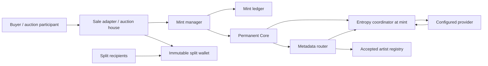

# Current architecture

This page describes the working development/testnet stack. It is pre-audit and
not production-ready. Read the [threat model](threat-model.md) for trust boundaries.
The [specification set](spec-policy.md) owns the wider
permanent protocol target; [release readiness](release-readiness.md) owns what
evidence has been accepted. The [older architecture](reference/legacy-stack/architecture.md)
is retained for historical modules and regression fixtures.

## System components

| Component | Owns | Caller boundary |
| --- | --- | --- |
| `StreamCore` | ERC-721 ownership, collection supply, token identity, token data, coordinator-at-mint, satellite pointers, bounded external reads | Core capability interfaces |
| `StreamMintManager` | Phase policy, permitted executors, counter configuration, mint execution | Mint execution, reads, administration |
| `StreamMintLedger` | Shared counters and consumed authorizations/operation roots | Manager-authorized writer |
| `StreamFixedPriceSaleAdapter` | Artist/platform consent and native fixed-price purchase | `SaleAuthorization` and `buy` |
| `StreamEnglishAuctionHouse` | Auction NFT custody, bids, end time, refunds, settlement | `AuctionAuthorization`, bid/settlement API |
| `StreamCollectionArtistRegistry` | Nomination and permanent accepted attribution for a collection | Artist acceptance and attribution reads |
| `StreamSplitFactory` / `StreamSplitWallet` | Canonical immutable split profile and pull-payment shares | Profile discovery and asset release |
| `StreamEntropyCoordinator` | Token/scope subjects, requests, bound provider, final seed | Registration/request API and entropy views |
| `StreamEntropyProviderVRF` | Chainlink request binding and retained result delivery | Provider request/status/callback API |
| `StreamMetadataRouter` | Collection presentation, on-chain artwork, metadata composition | Core-routed metadata reads |
| `StreamRoyaltyResolver` | Collection/default ERC-2981 disclosure policy | Core-routed royalty reads |
| `StreamGovernanceExecutor` / `StreamRoleRegistry` | Delayed actions, per-call context, root and guardian authority | Governance execution, administration, reads |
| `StreamModuleRegistry` | Exact module records, code hashes, interfaces, eligibility | Canonical module discovery |
| `StreamSystemManifest` | Published commitments and installed-module discovery | Manifest reads and governed publication |

See the [source map](../smart-contracts/README.md) for implementation paths and
the [interface map](../smart-contracts/interfaces/stream/README.md) for imports.
Additional finality, preservation, record, dependency, access, and Artist V2
components exist at different implementation stages. Presence in the source
tree or release catalog does not mean a current deployment installs them.

Artist architecture packets maintain current dependency paths and digests so
their references remain checkable. Their `evaluated_base` still records the
original proposal provenance. Updating those references changes neither the
architecture decisions nor the implementation stops, and grants no readiness
or implementation credit.

## State and call flow

A fixed-price purchase checks both signatures and current policy, consumes its
authorization, and funds the signed split wallet before manager → ledger → Core
minting. A mint or receiver failure reverts the entire transaction, including
payment and replay state. An auction mints into auction-house custody first;
bids escrow ETH, prior bids become withdrawable refunds, and final settlement
funds the wallet and transfers the NFT atomically.

Minted supply is lifetime issuance. Burning a token does not replenish that
budget. Token IDs and collection serials remain recorded, and each token keeps
its original entropy coordinator even if a collection pointer later changes.

## Authority boundaries

Genesis establishes real runtime authority. The bootstrap authority commits
one exact plan; a preparation transaction binds the governance catalog and
guardians. Initialization executes the committed product setup through the
executor's normal per-call context and ends sealed. The initializer is then
closed. See the [genesis/deployment guide](../script/current/README.md).

After sealing, governed changes use the executor's action class, scheduling
delay, target/selector/code-hash catalog, and any required manifest tail.
There is no generic deployer bypass. Catalog extensions are append-only,
root-proposed class-3 actions with a 48-hour delay and atomic fresh manifest
publication. A pointer change alone does not authorize configuration calls on
the replacement contract.

The development deployment transfers product ownership to the executor and
uses separate callable development governance actors. Production custody and
signing readiness are separate release requirements. Artist acceptance is
different authority: the nominated artist accepts directly or by signature;
the current attribution is permanent once accepted. It is not the full Artist
V2 recovery/lifecycle system.

## Entropy and metadata

Core registers minted token identity with its coordinator. A request binds
the configured provider and inputs; fulfillment commits one final seed.
Stale/failed handling does not grant a free reroll. Scope requests require a
registered scope and cannot rewrite a token subject. A revoked provider's
retained output is handled through the explicit provider/coordinator lifecycle.

Metadata reads use `Core.tokenURI`. The router reads token identity and
`coordinatorAtMint`, then consumes the read-only entropy interface. A finalized
on-chain animation includes token data in its HTML; JSON indicates that location
instead of duplicating the payload. Before finalization it describes pending,
stale, or failed state. See [metadata integration](integrations/metadata-rendering.md).

Core bounds calls and return data. The current deployment allocates 12 million
gas to the router; supported maximum-content reads require at least 16 million
total call gas. RPC defaults can be too low. A fallback response or RPC failure
must not be presented as proof that final metadata is absent.

## Value and custody boundaries

- The fixed-price payer is the signed caller and sends exactly the signed price.
- An auction bidder owns its refund credit; its NFT delivery recipient can differ.
- Split recipients own wallet release rights. Anyone can release to the account
  itself; only that account may redirect its share to another recipient.
- Official sale proceeds and unsolicited wallet receipts are different concepts.
  The wallet can distribute native deposits that did not originate from a sale.
- ERC-2981 reports a receiver/rate; it does not enforce a marketplace payment.

Use [payments](integrations/withdrawals-and-credits.md) and
[events](integrations/events-and-indexing.md) to construct accounting views.

## Product Extension And Size-Budget Policy

Core holds permanent ownership, supply, identity, and necessary authorization
seams. Prefer satellites, narrow read adapters, libraries, or off-chain
artifacts for new product features. A new UI query does not automatically need
a permanent Core function. Interface segregation improves dependency clarity;
it does not require splitting one coherent state machine across deployments.

Core's runtime-size policy remains in
[`release-artifacts/contracts.json`](../release-artifacts/contracts.json).
The [bytecode release proof](../release-artifacts/latest/bytecode-release-proof.json)
owns the canonical release measurement. Target-isolated artifacts establish release size; an aggregate
`forge build --sizes` report is diagnostic. Constructor arguments, linked
libraries, deployment profile, initcode, and public runtime verification have
their own evidence. Do not spend bytecode based on an unrelated profile's size.

The current profile and release snapshots retain Solidity 0.8.19 and reviewed
optimizer/metadata settings. Moving functions between interface inheritance
levels can change ERC-165 IDs even when method selectors stay constant. Source
reorganization must preserve published IDs and ABI compatibility deliberately.

## Coverage and remaining work

Current integration tests use actual protocol contracts and a controlled
external provider. Domain tests isolate behavior; legacy regressions preserve
earlier modules. See [the test guide](../test/README.md) for their distinct scopes.

The working native sale/auction stack does not establish full-v1 typed primary
settlement, complete artist lifecycle/recovery, every optional module, additional
payment modes, or external audit completion. [Known blockers](known-blockers.md),
the [conformance matrix](launch-conformance-matrix.md), and
[backlog](../ops/EXECUTION_BACKLOG.md) retain those requirements.
