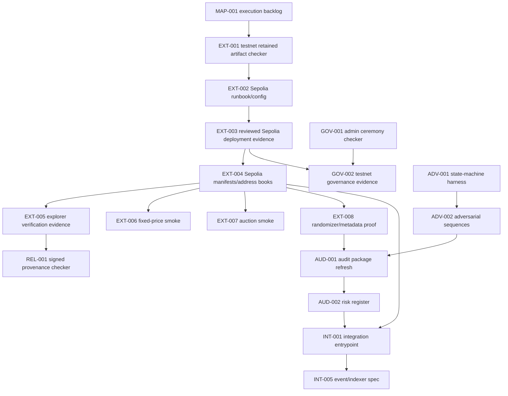

# 6529Stream Execution Backlog

Status: active implementation map.

This backlog turns the strategic roadmap in `ops/ROADMAP.md` into PR-sized
work. It combines three inputs:

- The repo-level audit performed during the autonomous run.
- The external structural assessment: 6529Stream is a serious pre-audit
  protocol stack, not production-ready, with the largest remaining gaps in
  external execution evidence, release proof, governance operations, and
  adversarial validation.
- The integration-readiness target for a 6529.io-style product stack across
  React, mobile, Electron, indexers, wallets, and operator tooling.

The target is a 10/10 open-source NFT protocol repo: auditors, frontend
engineers, operators, contributors, and protocol maintainers can independently
understand, verify, deploy, integrate, and monitor the system without private
conversation context.

## 0. Operating Model

### Canonical Files

| File | Purpose |
| --- | --- |
| `ops/ROADMAP.md` | Strategic gates, maturity status, launch criteria, and long-form issue context |
| `ops/EXECUTION_BACKLOG.md` | PR-sized implementation map and dependency ordering |
| `ops/AUTONOMOUS_RUN.md` | Current branch, active PR, merge/review state, and running worklog |
| `ops/SLITHER_BASELINE.json` | Canonical normalized first-party production High/Medium static-analysis finding set and open classifications |
| `ops/SLITHER_BASELINE.md` | Checked reviewer-facing mirror of the normalized static-analysis baseline |
| `release-artifacts/latest/` | Generated release state that must stay deterministic |

### Anti-Drift Rules

- Prefer substantive PRs over standalone reconciliation PRs.
- Fold roadmap/run-state updates into the delivery PR that made them true.
- Mark scaffolds, templates, and checkers as scaffolds. Do not describe them as
  completed evidence until reviewed real artifacts exist.
- Every PR must advance at least one readiness lane:
  - contract safety,
  - adversarial testing,
  - non-local execution evidence,
  - release integrity,
  - governance operations,
  - integration readiness,
  - audit readiness,
  - open-source contributor quality.
- If a PR only reorganizes state, it must explain why that reorganization is
  blocking execution.

### PR Item Shape

Each implementable item should be refined into this shape before work starts:

- Problem.
- Outcome.
- Gate and readiness blocker.
- Files likely touched.
- Implementation steps.
- Required tests/checks.
- Acceptance criteria.
- Evidence artifacts.
- Dependencies.
- Issue and PR links.

### Work Type Codes

| Code | Meaning |
| --- | --- |
| `MAP` | Execution planning and backlog control |
| `EXT` | External execution evidence: fork, testnet, live, explorer, retained transcripts |
| `ADV` | Adversarial, invariant, fuzz, fork, or economic attack tests |
| `CON` | Contract/API hardening and event/read-model improvements |
| `REL` | Release engineering, signatures, artifact integrity, reproducibility |
| `GOV` | Governance, Safe, signer, pause, incident, monitoring operations |
| `INT` | Frontend, SDK, indexer, mobile, Electron, and product integration readiness |
| `ONE` | World-class 1/1 NFT product surfaces: provenance, permanence, royalties, marketplaces |
| `AUD` | Audit packet, risk register, finding intake, external-audit closure |
| `OSS` | README, contributor, security, issue/PR templates, repo experience |

## 1. Current Maturity Frame

### Correct Classification

6529Stream is currently a high-quality pre-audit smart-contract protocol stack.
It is not a beta or production system.

The important distinction is:

- It is not a toy or early prototype.
- It is not nearly production-ready.
- It is structured to become audit-ready and release-ready once external
  evidence, adversarial proof, governance proof, and release proof are complete.

### What Is Already Strong

- Multi-contract protocol decomposition is strong.
- EIP-712 and ERC-1271 drop authorization are implemented.
- Auction custody, settlement, pull credits, and no-bid paths have target-state
  tests.
- Fixed-price, auction, curator, emergency-withdrawal, pause, signer, metadata,
  dependency, ERC-4906, and randomizer flows have significant local coverage.
- Local deployment, auction ceremony, emergency redeployment, release artifact,
  manifest, checksum, and evidence scaffolds exist.
- At least one reviewed fork deployment rehearsal artifact exists.
- A clean-main reviewer reassessment at
  `dd61e79d1fba5dbfec105b46ee0544fed105b95e` reported passing `forge build`,
  `forge test -vvv` with 316 tests, gas snapshot checks, and the production size
  build. This confirms the near-term focus should shift from generic "basic
  contract missing" work to evidence, product standards, and integration proof.

### What Still Blocks 10/10

- Testnet and live execution evidence are missing or incomplete.
- Explorer verification proof and verified address evidence are incomplete.
- Signed release provenance and signed tags are incomplete.
- Production governance ceremony proof is incomplete.
- Reviewed signer custody and production signing evidence are incomplete.
- Public beta remains blocked until external audit evidence, testnet
  deployment evidence, verified addresses, and explorer verification are
  retained and reviewed. Production remains blocked until live ceremony
  evidence, production deployment manifests, production signatures, signed
  tags, explorer verification, live randomizer evidence, live marketplace and
  metadata browser evidence, and post-audit remediation are retained and
  reviewed.
- Cross-contract adversarial testing is good but not exhaustive enough for the
  auction/drop/randomizer/admin interaction surface.
- Integrator documentation now covers frontend, mobile, Electron, indexer,
  wallet, metadata, auction, fixed-price, and operator UI consumers, but typed
  snippets, conformance fixtures, and reference UI code remain follow-up work.
- Contract-level metadata now exists as a release-tracked
  `StreamContractMetadata` satellite/read-adapter, with reviewed fork/testnet
  marketplace and indexer discovery evidence retained. Live marketplace and
  indexer evidence remains incomplete.
- 1/1 collector trust surfaces need a stronger product layer: artist statement,
  certificate/authenticity hash, curation notes, exhibition/history records,
  provenance events or retained evidence, and frozen provenance manifests.
  Transient Labs-style story/provenance inscriptions are the comparison point.
- Royalty philosophy is not explicit enough for a high-value 1/1 drop:
  ERC-2981 disclosure, governance controls, per-token/per-collection strategy,
  and optional transfer-validator/ERC721C-style creator-fee enforcement must be
  a deliberate decision with the permissionless-transfer composability tradeoff
  named.
- Permanence needs an independently replayable collector package: renderer,
  dependencies, source archive, token output hashes, browser proof, and storage
  guarantees. Art Blocks-style deterministic replayability is the benchmark for
  renderer-dependent output.
- Marketplace/indexer compatibility now has reviewed fork/testnet retained
  evidence; live marketplace/indexer evidence is still required before
  production release claims.
- `StreamCore` bytecode headroom remains tight, so new feature surfaces should
  prefer satellite contracts, libraries, adapters, or explicit size-budget
  exceptions.
- Compiler/lint/NatSpec warning noise should be burned down or dispositioned
  before making "world-class" release claims, including unused randomizer
  parameters, pure/view mutability suggestions, invalid NatSpec tags, and
  accepted static-analysis/linter warnings.
- The repo has accumulated too much run-state bookkeeping relative to
  substantive maturity work.

### Reviewer Rebaseline Mapping

The clean-main reviewer reassessment should steer implementation priority. Do
not reopen reviewer-confirmed fixed protocol surfaces unless a new test or
audit finding identifies a concrete regression. Convert each remaining reviewer
gap into a bounded issue or evidence artifact.

| Reviewer finding | Roadmap owner | Implementation posture |
| --- | --- | --- |
| EIP-712 drop authorization, ERC-1271 signer support, replay controls, auction custody, pull credits, ERC-4906, freeze manifests, and randomizer lifecycle are already present on mainline | Gate C/D/F evidence | Preserve through adversarial tests, audit packet traceability, and no-secret release evidence; do not create generic rebuild issues |
| Production trust evidence is still missing | `EXT`, `GOV`, `REL`, `AUD` | Prioritize reviewed testnet/live artifacts, explorer verification, signed release provenance, production signing/custody evidence, and completed external audit artifacts |
| Contract-level metadata needs live discovery evidence | `ONE-001`, `INT-006`, `ONE-005` | Preserve the merged ERC-7572-style `StreamContractMetadata` adapter, `ContractURIUpdated`, URI hash semantics, interface/event catalog updates, marketplace fallback docs, and reviewed fork/testnet marketplace/indexer evidence; retain live marketplace/indexer evidence before production release claims |
| 1/1 provenance is under-modeled | `ONE-002` | Define collection/token provenance manifests, artist statement, authenticity hash, curation/exhibition history, mutable versus frozen fields, and event/artifact boundaries; use Transient Labs-style story/provenance inscriptions as a benchmark |
| Royalty philosophy is implicit | `ONE-003` | Document ERC-2981 disclosure limits, governance, per-token/per-collection strategy, creator-fee enforcement or ERC721C-style transfer-validator tradeoffs, permissionless-transfer composability impact, and marketplace display evidence |
| Collector permanence is not independently replayable | `ONE-004`, `REL-007` | Add renderer/dependency/source archive hashes, replay commands, token output hashes, browser proof, and storage-guarantee language; use Art Blocks-style deterministic replayability as the benchmark |
| Marketplace/indexer compatibility needs live retained proof | `ONE-005`, `INT-005`, `INT-006` | Public-beta fork/testnet evidence is retained for OpenSea/Reservoir/Blur/Manifold or equivalent tooling, token refresh, animation rendering, royalties, transfer/sale path, event replay, and cache invalidation; retain live evidence before production release claims |
| `StreamCore` has 424 bytes of EIP-170 headroom at the current 24,152-byte runtime: the interim development floor passes under an accepted exception, but the normative 2,000-byte production deployment rule fails | `ONE-006`, `CON-005`, `P1-SIZE-001`, [#654](https://github.com/6529-Collections/6529Stream/issues/654) | Block production release; recover real headroom through compression, extraction, or authorized relocation while retaining mandatory hooks; keep satellites/read adapters/libraries/release artifacts as the default extension path |
| Compiler/lint/NatSpec noise remains a polish gap | `ONE-007`, `OSS-005` | Capture warning baseline, fix low-risk first-party warnings such as unused randomizer params, pure/view suggestions, and invalid NatSpec tags, disposition accepted noise, and decide whether new warning categories should fail CI |

Benchmark inputs: EIP-712, ERC-1271, ERC-4906, ERC-7572, ERC-2981, Chainlink
VRF best practices, Art Blocks on-chain storage practice, Manifold creator
contracts, Transient Labs creator/provenance patterns, and Limit Break creator
token standards. These inputs should inform acceptance criteria and integrator
docs, but any adopted behavior still needs an explicit ADR/design decision,
tests, release artifacts, and size-budget review where applicable.

## 2. Readiness Gates

| Gate | Name | Status Frame | Backlog Lanes |
| --- | --- | --- | --- |
| A | Reproducible baseline | Mostly complete, keep guarded | `OSS`, `REL`, `MAP` |
| B | Protocol decisions | Mostly complete, keep traceable | `CON`, `AUD` |
| C | P0 implementation | Mostly complete, re-audit for drift | `CON`, `ADV`, `AUD` |
| D | Test/invariant baseline | Partially complete, needs deeper adversarial tests | `ADV`, `CON` |
| E | Deployment rehearsal | Partially complete locally/fork, missing testnet/live proof | `EXT`, `GOV`, `REL` |
| F | External audit package | Scaffolding exists, completed audit evidence missing | `AUD`, `EXT`, `REL` |
| G | Open-source release | Partially complete, integration docs and signed provenance missing | `OSS`, `INT`, `REL` |

## 3. First 30 PR Queue

This queue starts with the active branch items, then lists the preferred
follow-up order unless bot feedback or CI forces a safer detour.

| Order | Item | Gate | Main Blocker | Intended PR |
| --- | --- | --- | --- | --- |
| 0 | `CON-009` | C/G | V1 split settlement foundation | Merged in PR #626; issue #625 closed completed |
| 0.1 | `CON-010` | C/G | V1 approved-standard ERC-20 split settlement foundation | Merged in PR #628; issue #627 closed completed |
| 0.2 | `CON-011` | C/G | V1 revenue resolver and primary-sale settlement adapters | Merged in PR #630; issue #629 closed completed |
| 0.3 | `CON-012` | C/G | V1 Core mint-manager boundary and prepared-mint hooks | Merged in PR #633; issue #631 closed completed |
| 0.4 | `CON-013` | C/G | V1 static mint ledger accounting foundation | Merged in PR #635; issue #634 closed completed |
| 0.5 | `CON-014` | C/G | V1 `StreamMintManager` phase policy and execution integration | Merged in PR #637; issue #636 closed completed |
| 0.6 | `CON-015` | C/G | V1 collection metadata and preservation record satellites | Merged in PR #639; issue #638 closed completed |
| 0.7 | `CON-016` | C/G | V1 mint gate interface and module registry foundation | Merged in PR #641; issue #640 closed completed |
| 1 | `EXT-001` | E/G | Public beta evidence | Finish testnet deployment rehearsal retained artifact checker |
| 2 | `MAP-001` | A/G | Execution clarity | Add this implementation backlog and link it from roadmap/run-state |
| 3 | `EXT-002` | E | Public beta evidence | Add Sepolia deployment config and no-secret rehearsal runbook |
| 4 | `EXT-003` | E | Public beta evidence | Retain reviewed Sepolia deployment rehearsal broadcast |
| 5 | `EXT-004` | E/G | Public beta evidence | Generate Sepolia manifest, address book, checksums, and source verification inputs |
| 6 | `EXT-005` | E/G | Public beta evidence | Retain explorer verification evidence for Sepolia contracts |
| 7 | `EXT-006` | E | Public beta evidence | Retain Sepolia fixed-price mint smoke evidence |
| 8 | `EXT-007` | E | Public beta evidence | Retain Sepolia auction bid, settle, withdraw smoke evidence |
| 9 | `EXT-008` | E | Public beta evidence | Retain Sepolia randomizer lifecycle and metadata browser evidence |
| 10 | `GOV-001` | E/F | Governance proof | Add Safe/admin ceremony evidence checker |
| 11 | `GOV-002` | E/F | Governance proof | Retain testnet role-grant and ownership-transfer ceremony evidence |
| 12 | `ADV-001` | D/F | Audit confidence | Add end-to-end protocol state-machine harness |
| 13 | `ADV-002` | D/F | Audit confidence | Add auction/drop/randomizer adversarial sequence tests |
| 14 | `ADV-003` | D/F | Audit confidence | Add signer compromise, cancellation, and epoch invalidation fuzz tests |
| 15 | `ADV-004` | D/F | Audit confidence | Add pause/unpause and settlement matrix invariants |
| 16 | `ADV-005` | D/F | Audit confidence | Expand payment/forced-ETH invariants across all owed categories |
| 17 | `REL-001` | F/G | Release proof | Add signed release provenance checker and retained artifact template |
| 18 | `REL-002` | F/G | Release proof | Add signed tag and checksum verification gate |
| 19 | `REL-003` | F/G | Release proof | Add exact bytecode-to-release proof |
| 20 | `AUD-001` | F | Audit readiness | Refresh audit packet around actual current contract state |
| 21 | `AUD-002` | F | Audit readiness | Add risk register and audit-boundary checker |
| 22 | `INT-001` | G | Integration readiness | Add integrations doc entrypoint and artifact source-of-truth guide |
| 23 | `INT-002` | G | Integration readiness | Add contract flow spec for fixed-price mint and drop authorization |
| 24 | `INT-003` | G | Integration readiness | Add auction frontend/indexer flow spec |
| 25 | `INT-004` | G | Integration readiness | Add wallet, EIP-712, ERC-1271, and Safe signing guide |
| 26 | `INT-005` | G | Integration readiness | Add event/indexer reconstruction spec |
| 27 | `INT-006` | G | Integration readiness | Add metadata rendering/cache/animation sandbox integration guide |
| 28 | `INT-007` | G | Integration readiness | Add React/Next reference architecture |
| 29 | `INT-008` | G | Integration readiness | Add mobile and WalletConnect integration guide |
| 30 | `INT-009` | G | Integration readiness | Add Electron security and wallet integration guide |

## 4. Detailed PR Items

### MAP-002: Reconcile v1 outside-Core launch scope

| Item | Title | Gate | Status |
| --- | --- | --- | --- |
| `MAP-002` | Reconcile v1 outside-Core launch scope | A/G | Merged in PR #623; issue #624 closed completed |

Status: Merged in PR #623; issue #624 closed completed.

Gate: A/G.

Problem: The maintainer rejected deferring approved-standard ERC-20 primary
settlement, C2PA/IIIF/PREMIS-style records, richer preservation satellites,
museum-grade metadata depth, and the entropy fallback decision. The roadmap and
specs needed one consistent launch target before implementation satellites
begin.

Outcome: Reconcile the v1 launch architecture, roadmap, conformance matrix,
revenue/royalty ADR, metadata, preservation, entropy, and release evidence
language around outside-Core v1 commitments.

Required checks: autonomous-state consistency, Markdown links, changelog gate,
release artifact generator checks, release artifact verification, and
`codex-diff-check` over the changed docs, ops, and release artifact paths.

Acceptance criteria: the docs agree that v1 ERC-20 primary settlement is an
outside-Core adapter/module requirement for approved standard assets; museum
metadata and preservation records are real v1 surfaces; preservation satellites
have launch conformance gates; and the entropy fallback decision is a retained
release-gated decision.

### MAP-001: Add 10/10 Execution Backlog

Status: Merged in PR #359.

Gate: A/G.

Problem: `ops/ROADMAP.md` is strategic and comprehensive, but too large to use
as the day-to-day autonomous implementation queue. Without a PR-sized backlog,
work drifts toward local state reconciliation and documentation churn.

Outcome: Add a durable execution backlog that combines internal review,
external structural review, and integration-readiness goals into sequenced,
implementable PR items.

Files likely touched:

- `ops/EXECUTION_BACKLOG.md`
- `ops/ROADMAP.md`
- `ops/AUTONOMOUS_RUN.md`

Implementation steps:

1. Add this backlog file.
2. Link it from the roadmap and autonomous run state.
3. Include first 30 PR queue, detailed PR items, acceptance criteria, and
   maturity gates.
4. Mark scaffolding separately from completed evidence.

Required tests/checks:

- `rg -n "^(#|##|###) " ops/EXECUTION_BACKLOG.md ops/ROADMAP.md ops/AUTONOMOUS_RUN.md`
- `git diff --check`

Acceptance criteria:

- A future autonomous run can pick the next substantive PR without conversation
  memory.
- The backlog clearly prioritizes real execution evidence and adversarial
  tests before further paperwork.
- Integration-readiness work is present but sequenced after core external proof
  items.

Evidence artifacts: None; roadmap-only change.

Dependencies: None.

### EXT-001: Finish Testnet Deployment Rehearsal Retained Artifact Checker

Status: Merged in PR #359; issue #357 closed completed. Issue #217 remains
open for future reviewed Sepolia deployment rehearsal evidence.

Gate: E/G.

Problem: Public beta evidence tracks `testnet_deployment_rehearsal`, but the
repo needs a dedicated retained artifact format and checker so future Sepolia
evidence is no-secret, reviewable, and machine-checked.

Outcome: A committed template and checker exist for testnet deployment
rehearsal evidence. The requirement remains blocked until a reviewed real
artifact is retained.

Files likely touched:

- `scripts/check_testnet_deployment_rehearsal_evidence.py`
- `scripts/test_testnet_deployment_rehearsal_evidence.py`
- `release-artifacts/evidence/testnet-deployment-rehearsal/`
- `release-artifacts/evidence/public-beta-templates/`
- `scripts/generate_release_evidence_packet_index.py`
- `Makefile`
- `scripts/check.sh`
- `scripts/check.ps1`
- `.github/workflows/ci.yml`
- `docs/non-local-release-evidence.md`
- `docs/release-readiness.md`
- `docs/tooling.md`
- generated release artifacts

Implementation steps:

1. Add a Markdown retained artifact template with fields for environment,
   chain ID, commit, CI run, broadcast, manifest, address book, explorer status,
   gas/invariant summary, redaction, operator, reviewer, and validation
   commands.
2. Add a checker that rejects missing headings, wrong requirement ID, wrong
   chain, reviewed artifacts with placeholders, missing validation commands,
   and secret-shaped values.
3. Add tests for the committed template, reviewed happy path, missing fields,
   placeholder misuse, and secret-shaped text.
4. Wire checker and tests into local/CI gates.
5. Update release evidence packet/backlog/body sync to point to the dedicated
   retained artifact.
6. Regenerate deterministic release outputs.

Required tests/checks:

- `python scripts/test_testnet_deployment_rehearsal_evidence.py`
- `python scripts/check_testnet_deployment_rehearsal_evidence.py`
- `python scripts/test_release_evidence_packet_index.py`
- `python scripts/generate_release_evidence_packet_index.py --check`
- `python scripts/test_release_evidence_issue_backlog.py`
- `python scripts/generate_release_evidence_issue_backlog.py --check`
- `python scripts/test_release_evidence_issue_body_sync.py`
- `python scripts/generate_release_evidence_issue_body_sync.py --check`
- `python scripts/test_release_manifest.py`
- `python scripts/generate_release_manifest.py --check`
- `python scripts/test_release_checksums.py`
- `python scripts/generate_release_checksums.py --check`
- `python scripts/check_release_readiness.py`
- `python scripts/check_changelog.py`
- `git diff --check`

Acceptance criteria:

- `testnet_deployment_rehearsal` remains marked missing/blocked until reviewed
  Sepolia evidence exists.
- The template is no-secret and cannot be mistaken for completed evidence.
- CI and local checks fail if future retained artifacts lose required review or
  validation data.

Evidence artifacts:

- Template only, not real evidence.

Dependencies: Issue `#217`; active issue `#357`.

### EXT-002: Add Sepolia Deployment Config And Rehearsal Runbook

Status: Merged in PR #361; issue #360 closed completed.

Gate: E.

Problem: A future operator needs an exact no-secret path for running the
testnet deployment rehearsal without inventing command flags, addresses, or
retained artifact structure.

Outcome: The repo contains a Sepolia rehearsal config template and a runbook
that explains how to run deployment, redact artifacts, generate manifests, and
validate retained evidence.

Files likely touched:

- `deployments/config/sepolia-6529stream-v0.1.0-001.template.json`
- `docs/deployment.md`
- `docs/non-local-release-evidence.md`
- `release-artifacts/evidence/testnet-deployment-rehearsal/`
- `scripts/test_deployment_manifest.py`

Implementation steps:

1. Add a Sepolia deployment config template with placeholder addresses and
   explicit no-secret comments where possible.
2. Document required environment variables without committing private RPC URLs
   or keys.
3. Document the command sequence for deployment, broadcast capture, manifest
   generation, address-book generation, source verification input generation,
   retained artifact review, and release evidence regeneration.
4. Add tests/checks that templates do not contain secret-looking values or
   live private URLs.

Required tests/checks:

- `python scripts/test_deployment_manifest.py`
- `python scripts/check_non_local_release_evidence.py`
- `python scripts/check_testnet_deployment_rehearsal_evidence.py`
- `git diff --check`

Acceptance criteria:

- A maintainer can identify the exact files to copy/edit for a Sepolia run.
- The runbook states which outputs are retained, redacted, hashed, and checked.
- No private key, RPC token, or unreleased drop payload can be committed in the
  template.

Evidence artifacts:

- Template and runbook only.

Dependencies: `EXT-001`.

### EXT-003: Retain Reviewed Sepolia Deployment Rehearsal Broadcast

Status: Planned; blocked locally until a reviewed Sepolia RPC/signer/funding
environment exists.

Gate: E.

Problem: Local and fork evidence do not prove the deployment path works against
a real public testnet with explorer-visible transactions and live chain
semantics.

Outcome: The repo retains reviewed no-secret Sepolia deployment rehearsal
evidence for `testnet_deployment_rehearsal`.

Files likely touched:

- `deployments/broadcasts/`
- `deployments/config/`
- `deployments/examples/`
- `deployments/address-books/`
- `release-artifacts/evidence/testnet-deployment-rehearsal/`
- `release-artifacts/evidence/public-beta-templates/testnet-deployment-rehearsal-template.json`
- generated release artifacts

Implementation steps:

1. Run the Sepolia deployment rehearsal using the documented command sequence.
2. Retain sanitized Foundry broadcast output.
3. Generate deployment manifest and address book from the sanitized broadcast.
4. Create the reviewed retained artifact from the template.
5. Generate the non-local evidence metadata envelope.
6. Regenerate public beta evidence, release packet index, issue backlog,
   manifest, and checksums.
7. Keep private RPC URLs, private keys, deployer secrets, and unreleased drop
   payloads out of the repo.

Required tests/checks:

- `python scripts/check_testnet_deployment_rehearsal_evidence.py`
- `python scripts/generate_non_local_release_evidence.py`
- `python scripts/check_non_local_release_evidence.py`
- `python scripts/check_public_beta_evidence.py`
- `python scripts/generate_release_evidence_packet_index.py --check`
- `python scripts/generate_release_manifest.py --check`
- `python scripts/generate_release_checksums.py --check`

Acceptance criteria:

- The retained artifact has review status `reviewed`.
- The retained artifact links commit, CI run, chain ID, block/transaction
  references, sanitized broadcast, manifest, address book, and validation
  commands.
- The public-beta evidence row for `testnet_deployment_rehearsal` can move from
  missing to complete only if all checker requirements pass.

Evidence artifacts:

- Reviewed retained artifact.
- Sanitized broadcast.
- Deployment manifest.
- Address book.
- Non-local metadata envelope.

Dependencies: `EXT-001`, `EXT-002`, live Sepolia RPC access.

### EXT-004: Generate Sepolia Manifest, Address Book, And Source Verification Inputs

Status: Planned; blocked by reviewed testnet deployment evidence from
`EXT-003`.

Gate: E/G.

Problem: Deployed addresses alone are not sufficient. Integrators, auditors,
and release tooling need deterministic manifests, address books, source
verification inputs, ABI checksums, and bytecode checksums tied to the exact
deployment.

Outcome: Sepolia deployment artifacts are generated from retained inputs and
included in the release manifest/checksum bundle.

Files likely touched:

- `deployments/examples/`
- `deployments/address-books/`
- `release-artifacts/latest/source-verification-inputs.json`
- `release-artifacts/latest/release-manifest.json`
- `release-artifacts/latest/SHA256SUMS`
- `release-artifacts/latest/release-checksums.json`
- `docs/tooling.md`
- `docs/deployment.md`

Implementation steps:

1. Extend existing generators if they assume only Anvil or fork-mainnet names.
2. Generate Sepolia manifest and address book from the sanitized broadcast.
3. Generate source verification inputs for Sepolia contracts.
4. Ensure release manifest includes Sepolia artifacts without claiming
   production readiness.
5. Update docs with exact artifact paths and commands.

Required tests/checks:

- `python scripts/test_broadcast_manifest_input.py`
- `python scripts/generate_broadcast_manifest_input.py --check`
- `python scripts/test_deployment_manifest.py`
- `python scripts/generate_deployment_manifest.py --check`
- `python scripts/test_address_books.py`
- `python scripts/generate_address_books.py --check`
- `python scripts/test_source_verification_inputs.py`
- `python scripts/generate_source_verification_inputs.py --check`
- `python scripts/generate_release_manifest.py --check`
- `python scripts/generate_release_checksums.py --check`

Acceptance criteria:

- Sepolia artifacts are generated from committed no-secret inputs.
- Drift checks fail if generated artifacts are stale.
- Integrators can find Sepolia addresses through the address book, not by
  reading a transcript manually.

Evidence artifacts:

- Sepolia manifest.
- Sepolia address book.
- Source verification inputs.
- Updated release manifest/checksums.

Dependencies: `EXT-003`.

### EXT-005: Retain Sepolia Explorer Verification Evidence

Status: Planned; blocked by generated Sepolia manifests and address books from
`EXT-004`.

Gate: E/G.

Problem: A deployment is not release-grade until each contract can be matched
to verified source and constructor/config inputs on the explorer.

Outcome: A checked retained evidence artifact records explorer verification
status for each Sepolia deployment address.

Files likely touched:

- `release-artifacts/evidence/public-beta-templates/explorer-verification-status-template.json`
- `release-artifacts/evidence/testnet-explorer-verification/`
- `scripts/check_explorer_verification_evidence.py`
- `scripts/test_explorer_verification_evidence.py`
- `docs/non-local-release-evidence.md`
- generated release artifacts

Implementation steps:

1. Add or extend an explorer-verification evidence schema/checker.
2. Record contract name, deployed address, chain ID, explorer URL, verification
   status, source input hash, compiler version, optimizer settings, and
   reviewer.
3. Reject unreviewed artifacts, private API keys, placeholder addresses, and
   mismatched chain IDs.
4. Wire the checker into local/CI gates.
5. Regenerate evidence packet and public-beta status.

Required tests/checks:

- New checker tests.
- New checker.
- `python scripts/check_public_beta_evidence.py`
- `python scripts/generate_release_evidence_packet_index.py --check`
- `python scripts/generate_release_manifest.py --check`
- `python scripts/generate_release_checksums.py --check`

Acceptance criteria:

- Every Sepolia deployment address has an explicit verification status.
- Failed or pending explorer verification is allowed only if it keeps readiness
  blocked.
- The artifact does not retain explorer API keys or private URLs.

Evidence artifacts:

- Explorer verification retained artifact.
- Optional non-local evidence metadata envelope.

Dependencies: `EXT-004`.

### EXT-006: Retain Sepolia Fixed-Price Mint Smoke Evidence

Status: Planned; blocked by reviewed Sepolia deployment/explorer evidence and
real RPC/signer/funding environment.

Gate: E.

Problem: Deployment evidence alone does not prove user-facing fixed-price mint
execution works on a public chain with real wallet/signature/transaction
semantics.

Outcome: Reviewed evidence shows a Sepolia fixed-price drop authorization,
mint, credit accounting, metadata state, and events.

Files likely touched:

- `release-artifacts/evidence/testnet-fixed-price-mint/`
- `docs/non-local-release-evidence.md`
- `docs/drop-authorization-signing.md`
- release evidence templates/checkers if needed

Implementation steps:

1. Generate a no-secret unsigned drop authorization payload.
2. Sign with an approved test signer or mock-safe flow.
3. Submit mint transaction on Sepolia.
4. Retain transaction hash, event log summary, recipient, collection/token IDs,
   metadata state, and credit balances.
5. Redact or omit private signer material and unreleased payloads.
6. Add a checker if the format is new.

Required tests/checks:

- Existing drop authorization evidence checks.
- Non-local evidence checks.
- Public beta evidence checks.
- Release manifest/checksum checks.

Acceptance criteria:

- Evidence demonstrates EOA or ERC-1271 signature path explicitly.
- Evidence records the EIP-712 domain and consumed drop ID/nonce.
- Evidence records expected events and no unexpected owed-balance drift.

Evidence artifacts:

- Reviewed fixed-price mint retained artifact.
- Optional sanitized transaction/log transcript.

Dependencies: `EXT-003`, `EXT-004`.

### EXT-007: Retain Sepolia Auction Ceremony Smoke Evidence

Status: Planned; blocked by reviewed Sepolia deployment evidence from
`EXT-003` and generated Sepolia manifests/address books from `EXT-004`.

Gate: E.

Problem: Auction correctness depends on multi-transaction state transitions:
mint, bid, outbid/refund credit, end, settle, proceeds credit, withdrawal, and
metadata state.

Outcome: Reviewed Sepolia evidence proves the auction ceremony can complete
with no stuck custody or owed-balance mismatch.

Files likely touched:

- `release-artifacts/evidence/testnet-auction-ceremony/`
- `docs/auction-custody.md`
- `docs/non-local-release-evidence.md`
- release evidence templates/checkers if needed

Implementation steps:

1. Create or reuse a Sepolia auction drop authorization.
2. Mint auction token and retain auction registration/state evidence.
3. Place initial bid and outbid.
4. Confirm previous bidder credit.
5. Advance or wait until settlement is valid.
6. Settle auction and withdraw proceeds/credits where applicable.
7. Retain events, balances, custody, state, and reviewed command transcript.

Required tests/checks:

- New or existing ceremony evidence checker.
- Non-local evidence checks.
- Public beta evidence checks.
- Release manifest/checksum checks.

Acceptance criteria:

- Token custody is known at every step.
- Previous bidder refund becomes withdrawable credit.
- Settlement is idempotent or replay-safe.
- Owed balances reconcile to expected zero/non-zero values after withdrawals.

Evidence artifacts:

- Reviewed auction ceremony artifact.
- Sanitized transaction/log transcript.

Dependencies: `EXT-003`, `EXT-004`.

### EXT-008: Retain Sepolia Randomizer And Metadata Browser Evidence

Status: Planned; blocked by reviewed Sepolia deployment evidence from
`EXT-003` and generated Sepolia manifests/address books from `EXT-004`.

Gate: E/D.

Problem: Randomizer lifecycle and generated metadata rendering need public-chain
proof, not only local tests.

Outcome: Reviewed Sepolia evidence shows pending, fulfilled/final or documented
fallback state, token metadata output, and browser sandbox execution against
deployed contracts.

Files likely touched:

- `release-artifacts/evidence/testnet-randomizer-operations/`
- `release-artifacts/evidence/testnet-metadata-browser/`
- `docs/randomizer-operations.md`
- `docs/metadata.md`
- `docs/non-local-release-evidence.md`
- metadata browser check scripts if needed

Implementation steps:

1. Trigger a mint path that requests randomness.
2. Record request ID, provider, collection, token, epoch, pending state, and
   fulfillment state.
3. Fetch token metadata from the deployed contract.
4. Run metadata browser sandbox checks against the fetched output.
5. Retain no-secret logs, hashes, and reviewer decision.
6. Keep readiness blocked if fulfillment cannot be completed.

Required tests/checks:

- `python scripts/check_randomizer_operations.py`
- `python scripts/check_rehearsal_metadata_browser_sandbox.py`
- Non-local evidence checks.
- Public beta evidence checks.
- Release manifest/checksum checks.

Acceptance criteria:

- Evidence ties request ID, token, collection, randomizer epoch, and provider.
- Metadata output is parsed and browser-sandbox checked.
- Pending/stale/failed/final status is explicit and not inferred.

Evidence artifacts:

- Reviewed randomizer operations artifact.
- Reviewed metadata browser artifact.

Dependencies: `EXT-003`, `EXT-004`.

### GOV-001: Add Safe/Admin Ceremony Evidence Checker

Status: Merged in PR #369; issue #362 closed completed.

Gate: E/F.

Problem: Governance controls are implemented, but production-like ownership,
role grants, signer setup, and pause authority need operational evidence.

Outcome: A no-secret retained artifact schema/checker exists for Safe/admin
ceremony evidence.

Files likely touched:

- `deployments/schema/admin-ceremony-evidence.schema.json`
- `deployments/admin-ceremony/`
- `scripts/check_admin_ceremony_evidence.py`
- `scripts/test_admin_ceremony_evidence.py`
- `scripts/generate_release_manifest.py`
- `scripts/generate_release_checksums.py`
- `docs/deployment.md`
- `docs/signer-custody-readiness.md`
- `docs/incident-response.md`
- `docs/release-readiness.md`

Implementation steps:

1. Define fields for deployer, Safe, owner transfer, role grants, signer setup,
   pause authorities, emergency recipients, verification status, operator,
   reviewer, and redaction.
2. Reject placeholders in reviewed evidence.
3. Reject private key/RPC/API-key shaped values.
4. Wire checker into local/CI gates, release manifest, checksum coverage, and
   release-readiness docs.

Required tests/checks:

- New checker tests.
- New checker.
- Release manifest/checksum checks.
- Release readiness check.
- `python scripts/test_admin_ceremony_evidence.py`
- `python scripts/check_admin_ceremony_evidence.py`

Acceptance criteria:

- A reviewer can reconstruct who controls each privileged surface.
- The artifact distinguishes testnet, fork, and production ceremonies.
- The artifact records whether ownership transfer and role grants are complete,
  pending, or intentionally blocked.
- Reviewed evidence cannot pass with template placeholders, stale retained
  hashes, zero privileged addresses, invalid environment/chain pairs, path
  escapes, secret-shaped values, or incomplete approval state.

Evidence artifacts:

- Template only in this PR.

Dependencies: Existing deployment manifest and signer custody docs.

### GOV-002: Retain Testnet Governance Ceremony Evidence

Status: Planned.

Gate: E/F.

Problem: Governance ceremony checkers only matter once they are exercised
against a real deployment.

Outcome: Reviewed Sepolia evidence proves owner transfer, role grant, signer,
pauser, emergency recipient, and verification ceremonies for the testnet
deployment.

Files likely touched:

- `deployments/admin-ceremony/`
- `release-artifacts/evidence/public-beta-templates/`
- `docs/deployment.md`
- generated release artifacts

Implementation steps:

1. Execute testnet ownership transfer or document why ownership remains with a
   test deployer.
2. Grant required roles.
3. Configure signer manager and drop signer.
4. Configure pause/emergency controls.
5. Retain transaction hashes and post-state views.
6. Review and validate the retained artifact.

Required tests/checks:

- `python scripts/check_admin_ceremony_evidence.py`
- `python scripts/check_signer_custody_readiness.py`
- Public beta evidence checks.
- Release manifest/checksum checks.

Acceptance criteria:

- Every privileged role has a known testnet holder.
- Unsafe temporary holders are marked temporary with a removal plan.
- Artifact is reviewed and no-secret.

Evidence artifacts:

- Reviewed testnet admin ceremony retained artifact.

Dependencies: `GOV-001`, `EXT-003`.

### GOV-003: Retain Reviewed Signer Custody Readiness Evidence

Status: Planned.

Gate: F/G.

Problem: Signer custody is currently documented by template, but production
readiness needs reviewed evidence of signer class, epoch source, rotation,
revocation, monitoring, and incident response.

Outcome: Reviewed signer custody readiness artifact exists and is linked from
release readiness without exposing secrets.

Files likely touched:

- `release-artifacts/signer-custody-readiness/`
- `docs/signer-custody-readiness.md`
- generated public beta/production blocker reports

Implementation steps:

1. Fill the signer custody template with reviewed no-secret operational facts.
2. Record signer class, manager, epoch source, rotation drill, revocation drill,
   ERC-1271 status, alerting, and incident links.
3. Validate with existing checker.
4. Regenerate release readiness and blocker reports.

Required tests/checks:

- `python scripts/test_signer_custody_readiness.py`
- `python scripts/check_signer_custody_readiness.py`
- `python scripts/check_release_readiness.py`
- blocker report checks.

Acceptance criteria:

- Artifact states who can sign, who can rotate, and how compromise is handled.
- Artifact does not reveal private keys, operational secrets, or private
  endpoint details.
- Release readiness reflects reviewed status accurately.

Evidence artifacts:

- Reviewed signer custody retained artifact.

Dependencies: Signer owner/operator decision outside repo.

### GOV-004: Add Pause And Incident Drill Evidence

Status: Merged in PR #481; issue #480 closed completed.

Gate: F.

Problem: Pause and incident runbooks exist, but the repo needs proof that
operators can execute drills and retain safe evidence.

Outcome: Evidence templates/checkers cover drills for mint pause, bid pause,
settlement pause, withdrawal policy, failed randomness, stuck auction, bad
metadata, bad Merkle root, and signer compromise.

Files likely touched:

- `docs/incident-response.md`
- `release-artifacts/evidence/incident-drills/`
- `scripts/check_incident_drill_evidence.py`
- `scripts/test_incident_drill_evidence.py`

Implementation steps:

1. Define incident drill evidence schema.
2. Add template rows for each required drill.
3. Reject reviewed artifacts that do not include operator, reviewer, commands,
   affected controls, observed events, and rollback/recovery status.
4. Wire checker into release readiness.

Required tests/checks:

- New checker tests.
- New checker.
- `python scripts/check_incident_response.py`
- `python scripts/check_release_readiness.py`

Acceptance criteria:

- Drills are tied to actual protocol controls and events.
- A missing drill keeps the relevant release gate blocked.
- Secret-shaped values are rejected.

Evidence artifacts:

- Templates only unless drills are actually executed.

Dependencies: `GOV-001`.

### ADV-001: Add End-To-End Protocol State-Machine Harness

Status: Merged in PR #371; issue #370 closed completed.

Gate: D/F.

Problem: Existing tests cover many surfaces, but audit confidence needs a
single harness that models cross-contract state across mint, auction,
randomizer, metadata, pause, signer, and payment flows.

Outcome: A reusable Foundry harness models protocol actions and exposes
assertions that future adversarial tests can reuse.

Completed implementation slice: added a deterministic smoke harness without
production contract changes. The first reusable helper covers local deployment,
fixed-price mint, auction outbid and settlement, fixed-price and auction credit
withdrawals, pause/unpause checks, signer rotation, drop cancellation,
immediate-randomizer metadata finalization, metadata mutation, and collection
freeze. Future ADV items should extend it with fuzzed adversarial sequences and
provider-specific randomness permutations.

Files likely touched:

- `test/helpers/ProtocolStateMachine.sol`
- `test/StreamProtocolStateMachine.t.sol`
- existing fixture/helpers
- `docs/threat-model.md`
- `ops/ROADMAP.md`

Implementation steps:

1. Define model state for collections, tokens, drop IDs, auctions, owed
   balances, randomizer requests, metadata states, paused domains, and signer
   epochs.
2. Add bounded actions for mint, bid, outbid, settle, withdraw, pause, unpause,
   rotate signer, cancel drop, request/fulfill randomness, and freeze metadata.
3. Add model assertions without changing production contracts.
4. Keep the first PR small enough to compile and run reliably.

Required tests/checks:

- `forge test --match-path test/StreamProtocolStateMachine.t.sol -vvv`
- `forge test -vvv`
- `python scripts/check_changelog.py` if external behavior docs change.

Acceptance criteria:

- Harness compiles and executes deterministic smoke sequences.
- Harness exposes reusable helpers for future fuzz/invariant PRs.
- No production behavior changes.

Issue: [`#370`](https://github.com/6529-Collections/6529Stream/issues/370).
PR: [`#371`](https://github.com/6529-Collections/6529Stream/pull/371).

Evidence artifacts: None.

Dependencies: Current fixture helpers.

### ADV-002: Add Auction/Drop/Randomizer Adversarial Sequence Tests

Status: Merged in PR #373; issue #372 closed completed.

Gate: D/F.

Problem: The highest-risk surface is the coupling of signed drop authorization,
auction state transitions, payment credits, and randomizer lifecycle. The first
adversarial slice should strengthen the reusable state-machine harness without
changing production contracts, while provider-specific wrong-request
randomizer permutations stay in lifecycle-specific tests.

Outcome: Deterministic adversarial sequences attempt unsafe ordering around
drop mint, bid, outbid, settlement, cancellation, signer rotation, replay, and
failed withdrawals, with exact revert assertions and custody/owed-balance
checks. Later ADV work should add fuzzed/randomizer-provider permutations.

Files likely touched:

- `test/StreamProtocolStateMachine.t.sol`
- `test/README.md`
- `docs/threat-model.md`
- `ops/ROADMAP.md`
- `ops/AUTONOMOUS_RUN.md`

Implementation steps:

1. Add deterministic adversarial ordering tests for cancelled, expired,
   stale-signer, and replayed drop authorizations.
2. Add negative sequences for replayed signatures, cancelled drops, expired
   signatures, stale epochs, paused domains, early settlement, underbids,
   cancellation after bid, repeat settlement, late bids, and failed
   withdrawals.
3. Assert token custody, owed balances, consumed drop IDs, bidder credits,
   proceeds credits, and withdrawal rollback invariants.
4. Document that wrong provider/request/token/collection randomness callback
   permutations remain lifecycle-specific follow-up work outside the
   immediate-randomizer state-machine helper.

Required tests/checks:

- `forge test --match-path test/StreamProtocolStateMachine.t.sol -vvv`
- `forge fmt --check test/StreamProtocolStateMachine.t.sol`
- Full local gate before PR.

Acceptance criteria:

- No sequence can produce unknown custody.
- No sequence can erase owed credit after failed withdrawal.
- No sequence can settle the same auction into duplicated proceeds.
- Cancelled, expired, stale-signer, and replayed drops fail without consuming
  new invalid drop IDs or mutating supply.
- Failed fixed-price and auction withdrawal attempts preserve the account
  credit and aggregate owed totals.
- Randomness callback request/token/collection permutations are either covered
  in lifecycle tests or explicitly deferred to `ADV-006`.

Evidence artifacts: None.

Dependencies: `ADV-001`.
Issue: [`#372`](https://github.com/6529-Collections/6529Stream/issues/372).

### ADV-003: Add Signer Compromise And Revocation Fuzz Tests

Status: Completed in PR
[`#377`](https://github.com/6529-Collections/6529Stream/pull/377).

Gate: D/F.

Problem: Signer compromise is a production-critical scenario. The contract and
frontend assumptions must prove drop IDs, signer epochs, cancellations, and
pauses stop stale authorizations.

Outcome: Tests cover signer rotation, per-drop cancellation, replay,
stale-epoch invalidation, current-signer epoch revocation, fixed-price and
auction recovery paths, and global drop-execution pause. Existing EIP-712 and
ERC-1271 suites continue to own wrong-domain, wrong-chain, wrong-contract,
compact-signature, malleability, and contract-signer permutations.

Files likely touched:

- `test/StreamSignerCompromiseFuzz.t.sol`
- `test/StreamDropsEIP712.t.sol`
- `test/StreamDropsERC1271.t.sol`
- `test/StreamSignerAdmin.t.sol`
- `test/StreamPauseControls.t.sol`
- `test/README.md`
- `ops/ROADMAP.md`
- `ops/AUTONOMOUS_RUN.md`
- `docs/drop-authorization-signing.md`
- `docs/threat-model.md`

Implementation steps:

1. Build a table of authorization invalidation mechanisms.
2. Add a deterministic signer-compromise drill for pause, rotation, epoch
   invalidation, cancellation, recovery, replay, and cancel-after-consumption.
3. Add bounded fuzz over fixed-price and auction signed payloads with
   cancellation, pause, signer rotation, epoch increment, and expiry choices.
4. Reuse existing EIP-712 and ERC-1271 suites for wrong domain, wrong chain,
   wrong contract, EIP-2098, malleability, and contract signer coverage.
5. Assert exact revert messages and signer/cancellation/consumption events
   where relevant.

Required tests/checks:

- `forge test --match-path test/StreamSignerCompromiseFuzz.t.sol -vvv`
- `forge test --match-path test/StreamDropsEIP712.t.sol -vvv`
- `forge test --match-path test/StreamDropsERC1271.t.sol -vvv`
- `forge test --match-path test/StreamSignerAdmin.t.sol -vvv`
- `forge test -vvv`

Acceptance criteria:

- Stale signatures cannot mint after signer rotation.
- Cancelled drop IDs cannot mint.
- Current-signer stale epochs cannot mint after epoch invalidation.
- Drop-execution pause blocks compromised payload execution.
- Fresh fixed-price and auction payloads from the recovered signer mint after
  revocation controls are applied.
- Replayed recovered payloads cannot mint twice.
- Cancellation after consumption fails without setting the cancelled flag.
- Failed compromise attempts do not consume invalid drop IDs, mint supply,
  create auctions, or alter fixed-price/auction owed balances.
- Bounded fuzz covers fixed-price and auction payloads across cancellation,
  pause, signer rotation, epoch increment, and expiry choices.
- Wrong chain/verifying contract/domain versions fail.
- ERC-1271 behavior is covered or explicitly documented.

Evidence artifacts: None.

Dependencies: Current EIP-712/ERC-1271 implementation, `ADV-001`, and
`ADV-002`.
Issue: [`#374`](https://github.com/6529-Collections/6529Stream/issues/374).

### ADV-004: Add Pause And Settlement Matrix Invariants

Status: Merged in PR #379; issue #378 closed completed.

Gate: D/F.

Problem: Pause controls and settlement/withdrawal policies interact with user
funds. Tests must prove emergency controls do not trap or erase owed balances
unless intentionally documented.

Outcome: Matrix tests cover mint pause, bid pause, settlement pause,
withdrawal policy, forced-surplus emergency withdrawals, duplicate-settlement
rejection, no-bid contract-poster settlement/claim pause behavior, custody
preservation, and owed-balance safety.

Files likely touched:

- `test/StreamPauseControls.t.sol`
- `test/StreamAuctionPayments.t.sol`
- `test/StreamPaymentsInvariant.t.sol`
- `test/README.md`
- `docs/incident-response.md`
- `docs/auction-custody.md`
- `ops/ROADMAP.md`
- `ops/AUTONOMOUS_RUN.md`

Implementation steps:

1. Enumerate pause domains and expected allowed/blocked functions.
2. Add snapshot-backed matrix tests for auction bid pause and settlement pause.
3. Assert paused bid and with-bid settlement attempts do not mutate custody,
   status, highest bid, bidder credits, proceeds credits, active escrow, total
   owed, contract balance, or emergency-withdrawable surplus.
4. Assert no-bid settlement and pending contract-poster claims stay paused
   without losing custody or pending-claimant state.
5. Assert user withdrawals remain available under operational pauses.
6. Add failed fixed-price, bidder-credit, proceeds-withdrawal, and
   duplicate-settlement checks under pause/unpause sequences.
7. Add forced-surplus emergency withdrawal boundary checks after paused states.

Required tests/checks:

- `forge test --match-path test/StreamPauseControls.t.sol -vvv`
- `forge test --match-path test/StreamAuctionPayments.t.sol -vvv`
- `forge test --match-path test/StreamPaymentsInvariant.t.sol -vvv`
- `forge test -vvv`

Acceptance criteria:

- Pause policies are executable and documented.
- Bid pause rejects new bids without changing highest bid, highest bidder,
  bidder credits, active escrow, total owed, contract balance, custody, or
  emergency-withdrawable surplus.
- Settlement pause rejects ended-auction settlement without changing custody,
  status, escrow, proceeds, total owed, contract balance, or surplus.
- No-bid contract-poster settlement and pending claims remain blocked while
  settlement pause is active and complete after unpause.
- User bidder and proceeds withdrawals remain available during operational
  pauses.
- Duplicate settlement cannot recreate proceeds after a pause/unpause sequence.
- Emergency controls can withdraw forced surplus during operational pauses but
  cannot withdraw owed funds.
- Failed fixed-price, bidder-credit, and proceeds withdrawals do not erase
  credit.

Evidence artifacts: None.

Dependencies: Existing pause controls, auction payments, and payment
invariants.
Issue: [`#378`](https://github.com/6529-Collections/6529Stream/issues/378).
PR: [`#379`](https://github.com/6529-Collections/6529Stream/pull/379).

### ADV-005: Expand Payment And Forced-ETH Invariants

Status: Merged in PR #381; issue #380 closed completed.

Gate: D/F.

Problem: Pull-payment design is strong, but the invariant suite should
explicitly cover all owed categories and forced-balance drift across more
operation sequences.

Outcome: Invariants prove total owed equals category owed balances, contract
balance covers owed balances, and forced ETH becomes surplus without corrupting
credits.

Files likely touched:

- `test/StreamPaymentsInvariant.t.sol`
- `test/StreamAuctionPayments.t.sol`
- `test/StreamFixedPricePayments.t.sol`
- `test/StreamCuratorsPool.t.sol`
- `docs/auction-custody.md`

Implementation steps:

1. Extend handlers for fixed-price poster/protocol credits, auction bidder
   credits, auction proceeds, curator credits, randomizer reserves, and forced
   ETH.
2. Add category and aggregate owed views to assertions.
3. Add failed withdrawal and rejecting-receiver actions.
4. Bound operation count to keep CI stable.

Required tests/checks:

- `forge test --match-path test/StreamPaymentsInvariant.t.sol -vvv`
- Focused payment/emergency suite with `Stream(AuctionPayments|FixedPricePayments|CuratorsPool|EmergencyWithdraw|RandomizerPayments|PaymentsInvariant)Test`
- `python scripts/check_randomizer_operations.py`
- `python scripts/generate_release_manifest.py --check`
- `python scripts/generate_release_checksums.py --check`
- `scripts/check.ps1`

Acceptance criteria:

- Aggregate owed totals match sum of categories after every sequence.
- Contract balances cover owed balances.
- Forced ETH is accounted as surplus or ignored as documented.
- Emergency withdrawal cannot take owed funds.

Evidence artifacts: None.

Dependencies: Existing payment invariant baseline.
Issue: [`#380`](https://github.com/6529-Collections/6529Stream/issues/380).

### CON-009: Implement Split Factory And Split Wallet Skeleton

Status: Merged in PR #626; issue #625 closed completed.

Gate: C/G.

Problem: ADR 0008 and the revenue split spec require immutable split profiles
and deterministic split wallets before resolver-backed primary settlement,
royalty assignments, and Core-native ERC-2981 can safely land. The current
protocol only has fixed three-bucket proceeds splits inside sale contracts.

Outcome: Add the first outside-Core implementation slice for
`StreamSplitFactory` and `StreamSplitWallet`, keeping `StreamCore` untouched.
The slice should support immutable fixed split profiles, deterministic
deployment/discovery, profile hashing, profile-entry events, one-shot
factory-bound initialization, native ETH receipt/release, and foundational read
views needed by later resolver and asset-policy work.

Files likely touched:

- `smart-contracts/StreamSplitFactory.sol`
- `smart-contracts/StreamSplitWallet.sol`
- `smart-contracts/IStreamSplitFactory.sol`
- `smart-contracts/IStreamSplitWallet.sol`
- `test/StreamSplitWallet.t.sol`
- `docs/revenue-splits-and-royalties.md`
- `docs/integrations/events-and-indexing.md`
- `CHANGELOG.md`
- `ops/AUTONOMOUS_RUN.md`
- `ops/EXECUTION_BACKLOG.md`
- `ops/workstreams/v1-contract-roadmap/active-context.md`
- `ops/workstreams/v1-contract-roadmap/run-log.md`
- `release-artifacts/latest/`

Implementation steps:

1. Define compact interfaces and custom errors for the fixed-profile wallet and
   factory.
2. Implement deterministic profile ID and wallet address derivation with
   `abi.encode` preimages that match ADR 0008.
3. Validate profile entries: non-empty, bounded count, non-zero account,
   non-zero share, exact `1_000_000` total, canonical ordering, and duplicate
   `(account, labelId)` rejection.
4. Derive aggregate account shares and unique account indexes from entries.
5. Deploy or discover wallets deterministically with `CREATE2`; initialize once
   in the same transaction; reject direct or second initialization.
6. Add pull-based native ETH release, release-to recipient, failed-release
   rollback, reentrancy protection, and owed/releasable/read views.
7. Emit reconstructable factory/profile/wallet/release events.

Required tests/checks:

- `forge test --match-path test/StreamSplitWallet.t.sol -vvv`
- `forge build`
- `python scripts/test_autonomous_state.py`
- `python scripts/check_autonomous_state.py`
- `python scripts/test_markdown_links.py`
- `python scripts/check_markdown_links.py`
- `python scripts/check_changelog.py`
- release artifact generator checks when release-covered docs or contracts
  change
- `codex-diff-check -- smart-contracts test docs ops release-artifacts/latest`

Acceptance criteria:

- The split wallet/factory are outside Core and spend no `StreamCore` bytecode.
- Deterministic profile IDs and wallet addresses are test-covered.
- Invalid profiles revert before deployment or initialization.
- Native receipts and releases preserve pull-payment safety, failed-release
  accounting, and reentrancy resistance.
- Events and reads allow indexers to reconstruct profile entries, wallet
  deployment/discovery, and releases.
- ERC-20 settlement, asset policy, resolver assignments, primary adapters,
  escrow, and Core-native ERC-2981 remain explicitly out of scope unless a
  minimal interface is needed for compilation.

### CON-010: Add Asset Policy Registry And ERC-20 Split-Wallet Release/Sync

Status: Merged in PR #628; issue #627 closed completed.

Gate: C/G.

Problem: The split wallet skeleton supports native ETH only, while the v1
launch target requires approved-standard ERC-20 release support and a
deployment-wide asset policy before ERC-20 primary-sale adapters or resolver
integration can safely land.

Outcome: Add an outside-Core asset policy registry plus ERC-20 split-wallet
observation/release support for explicitly approved standard tokens, preserving
the native ETH behavior from `CON-009` and rejecting unsupported ERC-20
semantics.

Files likely touched:

- `smart-contracts/StreamAssetPolicyRegistry.sol`
- `smart-contracts/IStreamAssetPolicyRegistry.sol`
- `smart-contracts/StreamSplitFactory.sol`
- `smart-contracts/StreamSplitWallet.sol`
- `smart-contracts/IStreamSplitFactory.sol`
- `smart-contracts/IStreamSplitWallet.sol`
- `test/StreamSplitWallet.t.sol`
- `docs/revenue-splits-and-royalties.md`
- `docs/integrations/events-and-indexing.md`
- `CHANGELOG.md`
- `ops/AUTONOMOUS_RUN.md`
- `ops/EXECUTION_BACKLOG.md`
- `ops/workstreams/v1-contract-roadmap/active-context.md`
- `ops/workstreams/v1-contract-roadmap/run-log.md`
- `release-artifacts/latest/`

Implementation steps:

1. Define a compact asset policy interface, statuses, events, and admin
   controls for approved standard ERC-20s.
2. Pin the asset policy registry through the split factory/wallet deployment
   surface while keeping `StreamCore` untouched.
3. Make ERC-20 assets default-deny and fail closed on policy read failure,
   unknown assets, inactive/deprecated assets, and non-contract assets.
4. Add explicit ERC-20 `syncAsset`, `observedReceived`, `releasable`,
   `roundingDust`, and `release` behavior for approved standard tokens.
5. Prove exact wallet-balance deltas for ERC-20 releases so fee-on-transfer,
   no-op, rebasing-down, callback, or otherwise non-standard behavior cannot
   silently mutate owed accounting.
6. Preserve native ETH behavior and events from the split wallet skeleton.

Required tests/checks:

- `forge test --match-path test/StreamSplitWallet.t.sol -vvv`
- `forge build`
- `python scripts/test_autonomous_state.py`
- `python scripts/check_autonomous_state.py`
- `python scripts/test_markdown_links.py`
- `python scripts/check_markdown_links.py`
- `python scripts/check_changelog.py`
- release artifact generator checks when release-covered docs or contracts
  change
- `codex-diff-check -- smart-contracts test docs ops release-artifacts/latest`

Acceptance criteria:

- The asset policy registry is outside Core and spends no `StreamCore`
  bytecode.
- Approved standard ERC-20 assets can be explicitly synced and released from
  split wallets.
- Unknown, inactive, deprecated, failing-registry, and non-contract assets
  revert before owed-credit mutation.
- ERC-20 release accounting uses exact pre/post wallet balance deltas and
  reverts unsupported token behavior.
- Native ETH split-wallet tests continue to pass.
- Events and reads allow indexers/frontends to reconstruct policy changes,
  asset observations, releases, and dust per asset.

### CON-011: Add Revenue Resolver And Primary-Sale Settlement Adapters

Status: Merged in PR #630; issue #629 closed completed.

Gate: C/G.

Problem: Split profiles, split wallets, and asset policy now exist, but
official primary-sale revenue still lacks an outside-Core resolver and adapter
surface that binds sale economics, verified split wallets, and approved
settlement assets before mint-manager integration lands.

Outcome: Add a minimal outside-Core revenue resolver and primary-sale
settlement adapter foundation for native ETH and approved standard ERC-20
assets, with deterministic assignment hashes, exact value accounting,
fail-closed ERC-20 policy reads, official settlement events, and no
`StreamCore` bytecode spend.

Files likely touched:

- `smart-contracts/IStreamRevenueResolver.sol`
- `smart-contracts/StreamRevenueResolver.sol`
- `smart-contracts/IStreamPrimarySaleSettlement.sol`
- `smart-contracts/StreamPrimarySaleSettlement.sol`
- `smart-contracts/StreamSplitFactory.sol`
- `smart-contracts/IStreamSplitFactory.sol`
- `test/StreamPrimarySaleSettlement.t.sol`
- `docs/revenue-splits-and-royalties.md`
- `docs/integrations/events-and-indexing.md`
- `CHANGELOG.md`
- `script/RehearseDeployment.s.sol`
- deployment configs, manifests, address books, source verification inputs, and
  generated release artifacts
- `ops/AUTONOMOUS_RUN.md`
- `ops/EXECUTION_BACKLOG.md`
- `ops/workstreams/v1-contract-roadmap/active-context.md`
- `ops/workstreams/v1-contract-roadmap/run-log.md`

Implementation steps:

1. Define deterministic resolver assignment structs, hashes, events, and
   default/collection primary revenue resolution.
2. Add primary-settlement adapter functions for native ETH and approved
   standard ERC-20 assets that verify policy hashes before recording official
   settlement evidence.
3. Reuse `StreamSplitFactory` profile existence, wallet derivation, and wallet
   deployment/discovery checks before accepting official primary revenue.
4. Measure exact native and ERC-20 value deltas, reject unsupported token
   behavior, and distinguish official primary deposits from passive wallet
   receipts.
5. Add replay or sale-id consumption controls for adapter-level settlement
   calls that represent accepted sale authorizations.
6. Keep mint manager, Core prepared mint, token-level snapshots, ERC-20 auction
   bidding, and royalty resolver integration out of scope unless a minimal
   compile/test interface is unavoidable.

Required tests/checks:

- `forge test --match-path test/StreamPrimarySaleSettlement.t.sol -vvv`
- `forge test --match-path test/StreamSplitWallet.t.sol -vvv`
- `forge build`
- `forge build --sizes --via-ir --skip test --skip script --force`
- `python scripts/test_autonomous_state.py`
- `python scripts/check_autonomous_state.py`
- release artifact generator checks when release-covered docs or contracts
  change
- `python scripts/check_changelog.py`
- `codex-diff-check -- smart-contracts test docs ops release-artifacts/latest`
- `powershell -NoProfile -ExecutionPolicy Bypass -File scripts\check.ps1`

Acceptance criteria:

- Resolver assignment hashes are deterministic and bind revenue class, scope,
  profile, wallet/factory, asset, mutability/freeze state, and active policy.
- Native ETH settlement proves exact `msg.value` and records official primary
  revenue for the verified split wallet/profile without push refunds.
- ERC-20 settlement accepts only `ACTIVE` approved standard assets, measures
  exact adapter balance deltas, and rejects malformed, no-return, no-op,
  fee-on-transfer, rebasing, or callback-dependent token behavior before
  revenue recording.
- Official settlement events expose enough fields for indexers to distinguish
  official primary-sale revenue from passive split-wallet receipts.
- Replay or duplicate sale IDs cannot create duplicate official settlement
  evidence.

### CON-012: Add Core Mint-Manager Boundary And Prepared-Mint Hooks

Status: Merged in PR #633; issue #631 closed completed.

Gate: C/G.

Problem: Revenue resolver and primary-sale settlement adapters now exist
outside Core, but future mint manager and settlement flows need a Core-owned
manager mint boundary, prepared-mint operation hooks, and canonical token
collection identity reads before policy, ledger, metadata, and preservation
satellites can safely compose.

Outcome: Add the minimal Core hook surface for manager-authorized minting and
same-flow prepared mints without moving the full Drops/Minter policy engine in
this PR.

Files likely touched:

- `smart-contracts/StreamCore.sol`
- `smart-contracts/IStreamCore.sol`
- optional `smart-contracts/IStreamMintManager.sol`
- focused Core mint-manager hook tests
- `docs/mint-policy-and-accounting.md`
- `docs/launch-v1-target-architecture.md`
- release artifacts and protocol-surface reports if ABI surfaces change
- `CHANGELOG.md`
- `ops/AUTONOMOUS_RUN.md`
- `ops/EXECUTION_BACKLOG.md`
- `ops/workstreams/v1-contract-roadmap/active-context.md`
- `ops/workstreams/v1-contract-roadmap/run-log.md`

Implementation steps:

1. Add a Core `mintManager` pointer and manager-only authorization for the new
   mint hooks; manager-specific events remain outside Core for this bytecode
   constrained slice.
2. Add `mintFromManager(...)` so future manager/sale modules can ask Core to
   allocate the next token for a collection internally.
3. Add prepared-mint prepare, complete, abort, and read hooks with operation ID
   replay protection and commitment binding.
4. Record token collection identity, derive collection serial and
   mapping-exists state, and retain burned/read state for manager and legacy
   mints.
5. Preserve the current `StreamDrops -> StreamMinter -> StreamCore` flow until
   a later PR intentionally routes it through the manager.
6. Measure and report Core runtime size for the final hook shapes.

Required tests/checks:

- focused Core mint-manager hook tests
- `forge test --match-path test/StreamMinterValidation.t.sol -vvv`
- `forge test --match-path test/StreamMintAccounting.t.sol -vvv`
- `forge test --match-path test/StreamDropsIntegrationCharacterization.t.sol -vvv`
- `forge test --match-path test/StreamMinterEvents.t.sol -vvv`
- `forge build`
- `forge build --sizes --via-ir --skip test --skip script --force`
- `python scripts/check_contract_size_budget.py`
- release artifact generator checks when ABI surfaces change
- `python scripts/check_changelog.py`
- `codex-diff-check -- smart-contracts test docs ops release-artifacts/latest`
- `powershell -NoProfile -ExecutionPolicy Bypass -File scripts\check.ps1`

Acceptance criteria:

- Only the configured `mintManager` can call Core manager mint, prepare, and
  complete hooks.
- Manager mint writes canonical collection identity and serial while preserving
  existing Core supply, freeze, token data, and randomizer behavior.
- Prepared mint records identity without ERC-721 ownership, rejects mismatched
  operation IDs, reused operation IDs, or commitments, and clears pending state
  before final `_safeMint`.
- Manager-only abort unwinds identity, token data, collection circulation
  supply, and pending prepared state for committed prepared mints that cannot
  complete.
- Token operations cannot successfully operate on incomplete prepared tokens.
- Reverts after prepare unwind identity, supply counters, and pending state.
- Safe receiver callbacks cannot observe or exploit an incomplete prepared
  token.
- Existing Drops/Minter fixed-price and auction flows continue to pass.

### CON-013: Add StreamMintLedger Static Counter Accounting Foundation

Status: Merged in PR #635; issue #634 closed completed.

Gate: C/G.

Problem: CON-012 gave Core a safe manager hook boundary, but the launch mint
roadmap still needs an outside-Core durable accounting contract before the full
`StreamMintManager` can consume phase/counter allowance and route future sale,
drop, or auction executors through a reviewed ledger.

Outcome: Add `StreamMintLedger` as a small satellite with authorized writers,
registered phase policy hashes, launch-static counter policies, monotonic
counter values, authorization replay protection, reconstructable events, and
focused tests. The slice deliberately leaves manager phase execution, Core mint
calls, payment settlement, custom gates, resolver modes, nullifiers, and legacy
flow migration for later PRs.

Files likely touched:

- `smart-contracts/IStreamMintLedger.sol`
- `smart-contracts/StreamMintLedger.sol`
- `test/StreamMintLedger.t.sol`
- release artifacts generated from `release-artifacts/contracts.json`
- mint/accounting, launch, roadmap, backlog, and run-state docs

Required tests/checks:

- `forge test --match-path test/StreamMintLedger.t.sol -vvv`
- `forge build`
- production size and release-artifact generator checks
- changelog and Markdown checks
- `codex-diff-check`
- full Windows `scripts\check.ps1` before merge

Acceptance criteria:

- Only authorized deployed-contract ledger writers can register policies and
  consume ledger state.
- Policy registration rejects invalid hashes, length mismatches, duplicate
  counter IDs, and unsupported future modes.
- Consumption verifies registered policy hashes and static counter policy before
  writing.
- Duplicate canonical value keys cannot bypass caps, and non-canonical supplied
  value keys are rejected.
- Authorization IDs are one-shot per manager; nullifiers remain explicitly unsupported.
- Existing Core, Minter, Drops, revenue, royalty, and preservation behavior is
  unchanged.

### CON-014: Add StreamMintManager Phase Policy And Execution Integration

Status: Merged in PR #637; issue #636 closed completed.

Gate: C/G.

Problem: PR #633 added the minimal Core mint-manager hooks and PR #635 added
the outside-Core static ledger foundation, but no manager path yet binds phase
policies to ledger consumption and prepared mint execution end-to-end.

Acceptance criteria:

1. `StreamMintManager` can register launch-static phase policies and coordinate
   the corresponding `StreamMintLedger` policy registration.
2. Manager execution consumes canonical ledger counters and then completes the
   reviewed prepared-mint flow without adding product policy to `StreamCore`.
3. Failed manager execution rolls back before consuming authorizations or
   mutating ledger counters.
4. Focused tests cover happy path, replay, cap, unknown policy/counter,
   rollback, writer authorization, and Core prepared-mint interaction.
5. Docs, deployment wiring, release artifacts, and run-state reflect the
   manager/ledger integration without claiming production readiness.

Outcome: PR #637 added `StreamMintManager` phase policy registration,
executor allowlists, launch-static ledger consumption, stale-policy and
authorization replay protection, Core prepare/complete execution, deployment
rehearsal wiring, release artifact coverage, and focused rollback/reentrancy
tests while keeping gates, resolver counters, callable nullifiers, and existing
Drops/Auctions routing as follow-up slices.

### CON-015: Add Collection Metadata And Preservation Record Satellites

Status: Merged in PR #639; issue #638 closed completed.

Gate: C/G.

Problem: The v1 launch scope requires real museum-grade metadata and
preservation surfaces outside Core, including C2PA/IIIF/PREMIS-style records,
fixity references, snapshots, schema commitments, and post-freeze preservation
evidence, without turning `StreamCore` into a metadata monolith.

Acceptance criteria:

1. `StreamCollectionMetadata` can store schema-bound collection metadata records
   for typed launch groups, publish immutable snapshots, expose latest hashes,
   and reject render-affecting mutation after Core collection freeze.
2. `StreamPreservationRecords` can append PREMIS/C2PA/IIIF/fixity-ready records
   with tagged hash references, record summaries, latest subject pointers, and
   duplicate record-hash protection.
3. Both satellites validate Core/Admin dependencies, use existing admin and
   metadata-mutation pause controls, expose module markers, support ERC-165,
   and keep all product metadata outside Core bytecode.
4. Launch-v1 writer permissions for mutating selectors are whole-module
   grants, not record-family delegation. The PR must document that custody
   model while keeping Core/Admin validation, pause controls, ERC-165 markers,
   and metadata-outside-Core constraints intact.
5. Focused tests cover happy paths, admin gates, pause gates, missing
   collections, freeze behavior, duplicate/revision/lock behavior, URI/hash
   validation, and event reconstruction.
6. Rehearsal deployment, deployment manifests, address books, release
   artifacts, changelog, and autonomous run state include the new satellites
   without claiming production readiness.

### CON-016: Add Mint Gate Interface And Module Registry Foundation

Status: Merged in PR #641; issue #640 closed completed.

Gate: C/G.

Problem: Launch v1 needs custom mint gates without adding gate-specific logic
to Core or letting arbitrary modules influence manager accounting. The manager
needs one approved gate boundary per phase, registry-pinned module identity,
policy-hash binding, and fail-closed mint-time revalidation before later
ticket, Merkle, TDH, auction-proof, or nullifier gate implementations land.

Acceptance criteria:

1. `IStreamMintGate`, `IStreamMintModuleRegistry`, and
   `StreamMintModuleRegistry` define the approved module boundary outside Core.
2. `StreamMintManager` can pin an optional active gate from the registry into a
   phase policy, including gate config hash, codehash, metadata hash, semantic
   version, gas limit, and module-registry identity.
3. Mint execution rechecks registry status, interface, codehash, metadata,
   semantic version, and gas limit before ledger/Core mutation.
4. Gate results can supply the effective authorization ID, authorizer,
   max-quantity ceiling, and gate evidence hash. Non-empty nullifier arrays are
   rejected until the later callable-nullifier slice.
5. Gate-derived authorization IDs flow into ledger replay protection and
   operation roots; ungated phases continue to require explicit request
   authorization IDs.
6. Focused tests cover registry admin gates, ERC-165/interface checks, status
   transitions, codehash pins, manager gate happy path, stale policy, replay,
   max quantity, nullifier rejection, blocked/deprecated/metadata-drifted
   modules, rollback, and event reconstruction.
7. Rehearsal deployment, release artifacts, changelog, and autonomous run state
   include the new registry/interface surfaces without claiming production
   readiness.

### CON-001: Re-Audit Public Entry Point And Event Surface

Status: Completed in issue #436 / PR #437.

Gate: C/D/G.

Problem: The contract surface evolved through many PRs. Before audit and
integration docs, the repo needs a fresh inventory of public/external
functions, custom errors, events, state transitions, and view/read-model gaps.

Outcome: A checked API surface report identifies integration-critical functions
and any missing events/views/docs.

Files likely touched:

- `scripts/generate_protocol_surface_report.py`
- `scripts/test_protocol_surface_report.py`
- `release-artifacts/latest/protocol-surface-report.json`
- `docs/protocol-surface.md`
- `release-artifacts/latest/release-manifest.json`
- `release-artifacts/latest/release-checksums.json`
- `docs/architecture.md`
- `docs/tooling.md`

Implementation steps:

1. Parse Foundry artifacts for public/external functions, events, and errors.
2. Classify each entry by contract and workflow.
3. Compare against documented flow coverage.
4. Emit a deterministic report and fail on drift.

Required tests/checks:

- New script tests.
- New report check.
- Release manifest/checksum checks.

Acceptance criteria:

- Every external state-changing function is classified.
- Event and custom-error surfaces are visible to auditors and integrators.
- Report drift is detected in CI or local checks.

Evidence artifacts:

- Generated protocol surface report at
  `release-artifacts/latest/protocol-surface-report.json`.
- Release-manifest and checksum-bundle coverage.
- Maintainer/integrator guidance in `docs/protocol-surface.md`.

Dependencies: Release artifact generator patterns.

Issue: [`#436`](https://github.com/6529-Collections/6529Stream/issues/436).

### CON-002: Close Event Schema Gaps For Indexers

Status: First slice completed in issue #438 / PR #439. Event
reconstructability coverage completed in issue #440 / PR #441.

Gate: D/G.

Problem: Frontend and indexer teams need stable events with indexed fields for
state reconstruction. Any missing state transition events should be found
before integration docs become canonical.

Outcome: Contract events, docs, and tests cover each external state transition
needed by product/indexer flows. The first slice added `StreamMinter` bridge
events for phases, fixed-price mint ranges, auction mint custody/end-time,
minter-side auction end-time edits, and minter contract-reference updates. The
follow-up proves reconstructability from emitted logs plus documented
read-after-event calls.

Files likely touched:

- `smart-contracts/StreamMinter.sol`
- `test/StreamMinterEvents.t.sol`
- `release-artifacts/latest/event-topic-catalog.json`
- generated release/deployment artifacts that pin ABI, runtime, topics, source
  verification, bytecode proof, manifests, and checksums
- `docs/integrations/auction-flows.md`
- `docs/integrations/events-and-indexing.md`
- `CHANGELOG.md`

Implementation steps:

1. Use `CON-001` report and integration flows to identify event gaps.
2. Add additive `StreamMinter` bridge events for the first event-read-model
   slice without touching `StreamCore`.
3. Add event assertion tests for emitted fields and read-after-event views.
4. Regenerate ABI/event/protocol-surface/source-verification/deployment/release
   artifacts.
5. Document the additive event/gas impact and keep remaining explicit auction
   end-state events as a later auction-contract decision.

Required tests/checks:

- Targeted Foundry tests.
- Gas snapshot update/check.
- `python scripts/generate_release_artifacts.py --check`
- Protocol surface, source verification, bytecode proof, manifest, checksum,
  events/indexing, and auction-flow checks.
- ABI compatibility check.
- Changelog check.

Acceptance criteria:

- Indexers can reconstruct drop, auction, credit, randomizer, metadata, and
  admin state without private contract introspection beyond documented reads.
- Event topic catalog is current.
- Breaking event changes are explicitly approved.

Evidence artifacts: Generated event topic catalog.

Dependencies: `CON-001`, `INT-005`.

Issue: [`#438`](https://github.com/6529-Collections/6529Stream/issues/438).
Follow-up: [`#440`](https://github.com/6529-Collections/6529Stream/issues/440)
completed in PR #441.

### REL-001: Add Signed Release Provenance Evidence Checker

Status: Completed in issue #156 / PR #157.

Gate: F/G.

Problem: Release artifacts and checksums exist, but production-grade release
integrity needs a retained evidence path for signatures, signer identity,
artifact hash, tag, and review.

Outcome: A checker validates signed release provenance artifacts without
requiring real production signatures yet.

Files likely touched:

- `release-artifacts/schema/release-signature-evidence.schema.json`
- `release-artifacts/signatures/`
- `scripts/check_release_signatures.py`
- `scripts/test_release_signatures.py`
- `docs/release-signatures.md`
- `docs/release-policy.md`

Implementation steps:

1. Review existing release signature template/checker and identify gaps.
2. Require tag, commit SHA, checksum bundle hash, signer fingerprint or address,
   signature status, reviewer, and verification command.
3. Reject placeholder values in reviewed artifacts.
4. Wire release signature status into release readiness.

Required tests/checks:

- `python scripts/test_release_signatures.py`
- `python scripts/check_release_signatures.py`
- `python scripts/check_release_readiness.py`
- Release manifest/checksum checks.

Acceptance criteria:

- Unsigned local placeholder evidence remains blocked.
- Reviewed signatures can only pass with exact commit/artifact linkage.
- The docs explain which signatures are required for public beta vs production.

Evidence artifacts:

- Template/checker in this PR; reviewed signature evidence later.

Dependencies: Existing release checksum bundle.

### REL-002: Add Signed Tag And Checksum Verification Gate

Status: Completed in issue #382 / PR #383.

Gate: F/G.

Problem: A release needs a canonical Git tag and checksum bundle that can be
verified independently.

Outcome: Local/CI checks can verify signed tag metadata and checksum integrity
for release candidate branches/tags.

Files likely touched:

- `scripts/check_signed_release_tag.py`
- `scripts/test_signed_release_tag.py`
- `docs/release-policy.md`
- `docs/release-signatures.md`
- `docs/release-readiness.md`
- `.github/workflows/ci.yml`

Implementation steps:

1. Define local behavior for branches without tags: blocked or skipped with
   explicit non-release status.
2. Verify tag points to current release commit when running in release mode.
3. Verify tag signature status, signer fingerprint, and checksum-bundle
   freshness in release mode.
4. Require matching post-bundle release-signature evidence so detached checksum
   signatures do not self-invalidate the `SHA256SUMS` bundle they prove.
5. Document exact maintainer command sequence.

Required tests/checks:

- New script tests.
- New script.
- Release readiness check.
- Local/CI non-release gate.

Acceptance criteria:

- Non-release PRs do not falsely claim signed release status.
- Release-mode checks fail if tag/signature/checksum linkage is missing.
- Release-mode checks fail if the signed tag verification output does not
  include the retained signer fingerprint.
- Docs support independent verification by an external user.
- Detached checksum signature evidence is rejected if it is already covered by
  the checksum bundle being verified.

Evidence artifacts:

- Signed tag verification report when used in release mode.

Dependencies: `REL-001`.

### REL-003: Add Exact Bytecode-To-Release Proof

Status: Merged in PR #385; issue #384 closed completed.

Gate: F/G.

Problem: Users and auditors need to verify that deployed bytecode matches the
release artifact bundle exactly.

Outcome: A deterministic proof ties source verification inputs, compiler
settings, bytecode hash, deployed address, chain ID, and release manifest.

Files likely touched:

- `scripts/generate_bytecode_release_proof.py`
- `scripts/test_bytecode_release_proof.py`
- `release-artifacts/latest/`
- `.github/workflows/ci.yml`
- `Makefile`
- `docs/tooling.md`
- `docs/release-policy.md`
- `docs/deployment.md`
- `docs/release-readiness.md`

Implementation steps:

1. Define proof schema for contract, address, chain ID, runtime bytecode hash,
   creation bytecode hash, compiler settings, artifact path, and release
   manifest hash.
2. Generate proof for committed local/fork artifacts where data is available.
3. Fail on hash mismatch, address mismatch, chain mismatch, compiler-setting
   mismatch, source-verification drift, release-manifest drift, or missing
   required fields.
4. Keep local/fork proof separate from production live-bytecode proof.

Required tests/checks:

- New script tests.
- New generator/checker.
- Release manifest/checksum checks.

Acceptance criteria:

- A verifier can connect a deployed address to a specific release bundle.
- Missing live production proof keeps production readiness blocked.
- The proof is deterministic and no-secret.
- The proof is checksum-covered without being embedded into the release
  manifest, avoiding a manifest/proof hash cycle.

Evidence artifacts:

- Bytecode release proof JSON.

Dependencies: committed deployment manifests, address books, source
verification inputs, and release manifest; production completion depends on
`EXT-004` and `EXT-005`.

### AUD-001: Refresh Audit Package Around Current Protocol State

Status: Merged in PR #387; issue #386 closed completed.

Gate: F.

Problem: Audit docs exist, but after many PRs the package needs a current,
reviewable snapshot that reflects actual code, tests, release artifacts, and
known gaps.

Outcome: Audit package is refreshed with current architecture, threat model,
ADRs, invariants, deployment evidence, release artifacts, known risks, and
integration assumptions.

Files likely touched:

- `docs/audit-package.md`
- `scripts/check_audit_package.py`
- `scripts/test_audit_package.py`
- `release-artifacts/latest/release-manifest.json`
- `release-artifacts/latest/bytecode-release-proof.json`
- `release-artifacts/latest/SHA256SUMS`
- `release-artifacts/latest/release-checksums.json`
- `ops/AUTONOMOUS_RUN.md`
- `ops/EXECUTION_BACKLOG.md`
- `ops/ROADMAP.md`
- `CHANGELOG.md`

Implementation steps:

1. Inventory current contract surface, tests, release artifacts, and evidence.
2. Update audit package sections with exact paths and commands.
3. Separate fixed risks, accepted risks, open risks, and evidence gaps.
4. Add audit submission checklist.
5. Require the audit package checker to enforce the new snapshot, checklist,
   bytecode proof, signed-tag, release-artifact, and external-evidence links.
6. Refresh deterministic release manifest, bytecode proof, and checksum
   artifacts because the audit package is a hashed governance document.

Required tests/checks:

- `python scripts/test_audit_package.py`
- `python scripts/check_audit_package.py`
- `python scripts/test_architecture_threat_model.py`
- `python scripts/check_architecture_threat_model.py`
- `python scripts/test_release_readiness.py`
- `python scripts/check_release_readiness.py`
- `python scripts/test_release_manifest.py`
- `python scripts/generate_release_manifest.py --check`
- `python scripts/test_bytecode_release_proof.py`
- `python scripts/generate_bytecode_release_proof.py --check`
- `python scripts/test_release_checksums.py`
- `python scripts/generate_release_checksums.py --check`
- `python scripts/check_changelog.py`
- `python -m py_compile scripts/check_audit_package.py scripts/test_audit_package.py`
- `git diff --check`

Acceptance criteria:

- Auditor can start from `docs/audit-package.md` without reading the whole
  roadmap first.
- Package states pre-production status honestly.
- Open external evidence gaps are not hidden by scaffolding.

Evidence artifacts: Audit package docs only.

Dependencies: Prefer after `EXT-003` through `EXT-008`, but can be partially
refreshed earlier if audit scheduling requires it. This branch intentionally
refreshes the local package now because the clean-main reviewer rebaseline and
REL-003 release proof changed what auditors should inspect first.

### AUD-002: Add Risk Register And Audit Boundary Checker

Status: Merged in PR #389; issue #388 closed completed.

Gate: F.

Problem: Risks are distributed across roadmap, Slither baseline, docs, release
blocker reports, and issues. Auditors need a single checked register that
distinguishes residual risk, accepted local-baseline findings, planned
mitigations, and open launch blockers without turning scaffolding into
readiness evidence.

Outcome: A generated, machine-readable risk register and checker exist. The
register is release-manifest and checksum covered, links to source documents
and evidence by SHA-256, rejects unsafe accepted-risk metadata, and keeps the
clean-main reviewer gaps visible as release blockers or planned mitigations.

Files likely touched:

- `release-artifacts/latest/risk-register.json`
- `release-artifacts/schema/risk-register.schema.json`
- `scripts/check_risk_register.py`
- `scripts/generate_risk_register.py`
- `scripts/test_risk_register.py`
- `docs/audit-package.md`
- `docs/release-readiness.md`
- `release-artifacts/README.md`
- `scripts/generate_release_manifest.py`
- `scripts/test_release_manifest.py`
- `scripts/generate_release_artifacts.py`
- `scripts/test_release_artifacts.py`
- `scripts/test_release_checksums.py`
- local/CI gate wiring
- generated release manifest, bytecode proof, and checksum artifacts

Implementation steps:

1. Define the JSON fields: risk ID, title, area, severity, status, owner,
   target gate, source, mitigation, residual risk, evidence file refs, checks,
   tracking refs, and optional accepted-risk metadata.
2. Add a schema file and a deterministic generator that computes evidence
   hashes from committed source documents, blocker reports, Slither baseline,
   audit package, and reviewer-rebaseline entries.
3. Seed risks for external evidence, external audit, release integrity,
   governance/signer custody, randomizer operations, marketplace/metadata
   evidence, 1/1 product excellence, `StreamCore` size headroom, static
   analysis, warning hygiene, and the audit-boundary register itself.
4. Add a checker that rejects missing fields, unexpected fields, duplicate or
   unsorted IDs, invalid statuses/severities/gates, missing required areas,
   missing `RISK-AUD-002`, stale evidence hashes, path escapes, missing
   tracking refs, unsafe accepted-risk metadata, and secret-shaped keys or
   assignment-looking values.
5. Wire checker, generator drift check, and tests into Makefile, Bash,
   PowerShell, and CI gates.
6. Include the risk register in the top-level release manifest and checksum
   coverage without adding it to the contract-derived release artifact
   manifest.
7. Link the register from the audit package, release-readiness dashboard, and
   release-artifacts guide.
8. Regenerate the register first, then release manifest, bytecode proof, and
   checksum artifacts.

Required tests/checks:

- `python scripts/test_risk_register.py`
- `python scripts/check_risk_register.py`
- `python scripts/generate_risk_register.py --check`
- `python scripts/test_audit_package.py`
- `python scripts/check_audit_package.py`
- `python scripts/test_release_readiness.py`
- `python scripts/check_release_readiness.py`
- `python scripts/test_release_artifacts.py`
- `python scripts/generate_release_artifacts.py --check`
- `python scripts/test_release_manifest.py`
- `python scripts/generate_release_manifest.py --check`
- `python scripts/test_bytecode_release_proof.py`
- `python scripts/generate_bytecode_release_proof.py --check`
- `python scripts/test_release_checksums.py`
- `python scripts/generate_release_checksums.py --check`
- `python scripts/check_changelog.py`
- `python -m py_compile scripts/check_risk_register.py scripts/generate_risk_register.py scripts/test_risk_register.py`
- `git diff --check`

Acceptance criteria:

- Every P0/P1 residual risk or release-blocking assumption in the current
  committed sources has a status, owner, target gate, mitigation, checks, and
  evidence link.
- Accepted local-baseline risks are distinct from public-beta or production
  evidence completion.
- Missing production evidence remains visible as `open_blocker` or
  `planned_mitigation`, not hidden by templates.
- Evidence refs use forward-slash repo paths, stay inside the repo, exist, and
  match current SHA-256 hashes.
- The release manifest exposes risk counts and the checksum bundle covers the
  register.
- The register avoids dependency cycles by not hashing downstream outputs such
  as `release-manifest.json` or `bytecode-release-proof.json`.

Evidence artifacts:

- `release-artifacts/latest/risk-register.json`.
- `release-artifacts/schema/risk-register.schema.json`.

Dependencies: `AUD-001`.

### INT-001: Add Integrations Entrypoint And Artifact Source Of Truth

Status: Merged in PR #391; issue #390 closed completed.

Gate: G.

Problem: A frontend, mobile, Electron, indexer, operator UI, or backend signing
engineer cannot yet start from a single integration entrypoint that explains
which artifacts, manifests, generated ABIs, event catalogs, metadata docs,
signing docs, release evidence, and chain configs to trust. Raw Foundry ABIs
are generated under ignored `out/` after `forge build`, so the repo needs a
tracked source-of-truth map that points integrators to stable checked artifacts
without pretending local scaffolding is production evidence.

Outcome: `docs/integrations/README.md` defines the integration surface, links
all canonical tracked artifacts, states the pre-audit maturity boundary, and
maps the follow-up INT-002 through INT-009 flow specs.

Files likely touched:

- `docs/integrations/README.md`
- `README.md`
- `docs/release-readiness.md`
- `release-artifacts/README.md`
- `scripts/check_integrations_readme.py`
- `scripts/test_integrations_readme.py`
- `scripts/check_release_readiness.py`
- `scripts/test_release_readiness.py`
- `scripts/generate_release_manifest.py`
- Makefile, Bash, PowerShell, and CI gate wiring
- generated release manifest, bytecode proof, risk register, and checksum
  artifacts if docs or manifest inputs change

Implementation steps:

1. Create integrations docs directory.
2. Define supported consumer types: React web app, mobile app, Electron app,
   indexer, operator UI, backend signing service.
3. Point to canonical ABI surface/checksum artifacts, address books, deployment
   manifests, release manifests, event topic catalog, interface IDs, metadata
   docs, deployment docs, signing docs, risk register, public-beta evidence
   status, release policy, and checksum bundle.
4. State pre-production/testnet caveats: pre-audit, not production-ready, local
   baseline only, not a security claim, and not a replacement for fork,
   testnet, live, audit, or marketplace/indexer evidence.
5. Add a checker and tests that require headings, maturity phrases, source of
   truth links, validation commands, and follow-up integration flow map.
6. Wire the checker into local and CI gates.
7. Add docs navigation links from README, release-readiness, and
   release-artifacts docs.
8. Regenerate downstream release artifacts after docs/checker changes.

Required tests/checks:

- `python scripts/test_integrations_readme.py`
- `python scripts/check_integrations_readme.py`
- `python scripts/test_release_readiness.py`
- `python scripts/check_release_readiness.py`
- `python scripts/test_release_manifest.py`
- `python scripts/generate_release_manifest.py --check`
- `python scripts/test_bytecode_release_proof.py`
- `python scripts/generate_bytecode_release_proof.py --check`
- `python scripts/test_release_checksums.py`
- `python scripts/generate_release_checksums.py --check`
- `python scripts/test_risk_register.py`
- `python scripts/check_risk_register.py`
- `python scripts/generate_risk_register.py --check`
- `python scripts/check_changelog.py`
- `python -m py_compile scripts/check_integrations_readme.py scripts/test_integrations_readme.py`
- `git diff --check`.

Acceptance criteria:

- A frontend engineer knows where to get addresses and ABIs.
- A product engineer knows which flows are documented and which are not.
- The doc does not claim production readiness.
- The doc explicitly says raw ABIs are generated under ignored `out/` and that
  the tracked source of truth is release artifacts, ABI surface/checksum
  outputs, event/interface catalogs, deployment manifests, address books, and
  evidence status files.
- React, mobile, Electron, indexer, operator UI, and backend-signing consumers
  each have a source-of-truth path and a clear later flow-spec owner.
- Local integration readiness is not represented as fork, testnet, live,
  marketplace, public-beta, audit, or production evidence.

Evidence artifacts: None.

Dependencies: `AUD-002`; best before `INT-002` through `INT-009`.

### INT-002: Add Fixed-Price Mint And Drop Authorization Flow Spec

Status: Merged in PR #393; issue #392 closed.

Gate: G/D.

Problem: Frontend teams need exact transaction, read, event, credit,
withdrawal, failure-state, and backend-signing guidance for fixed-price minting
through `StreamDrops.mintDrop`. The repo has strong Solidity tests and signing
docs, but a React, mobile, Electron, indexer, or backend signing service should
not need to reverse-engineer the happy path, negative states, replay controls,
credit accounting, or maturity boundaries from contract code.

Outcome: `docs/integrations/contract-flows.md` documents the fixed-price mint
flow as a checked pre-audit local baseline. It covers artifact inputs,
preflight reads, EIP-712 payload fields, EOA and ERC-1271 signing paths,
`mintDrop` submission, event monitoring, poster/protocol credit withdrawal UX,
curator reserve accounting, common failure states, frontend state transitions,
and backend signing-service boundaries without claiming production readiness.

Files likely touched:

- `docs/integrations/contract-flows.md`
- `docs/integrations/README.md`
- `README.md`
- `docs/release-readiness.md`
- `release-artifacts/README.md`
- `scripts/check_contract_flows.py`
- `scripts/test_contract_flows.py`
- `scripts/check_integrations_readme.py`
- `scripts/test_integrations_readme.py`
- `scripts/check_release_readiness.py`
- `scripts/test_release_readiness.py`
- `scripts/generate_release_manifest.py`
- Makefile, Bash, PowerShell, and CI gate wiring
- generated release manifest, bytecode proof, risk register, and checksum
  artifacts if docs or manifest inputs change

Implementation steps:

1. Document required source-of-truth artifacts before a frontend or backend
   signing service wires the mint flow.
2. Document preflight reads for `domainSeparator`, `tdhSigner`, `signerEpoch`,
   drop pause state, consumed/cancelled drops, fixed-price credits, owed totals,
   reserved funds, and surplus.
3. Document payload fields and source of domain values, including
   `saleMode = 1`, `deriveDropId`, `tokenDataHash`, payer rules, deadline, and
   storage-backed replay controls.
4. Document EOA and ERC-1271 signing paths and the backend signing-service
   private-key boundary.
5. Document `mintDrop(DropAuthorization,string,bytes)` submission, exact
   `msg.value` requirements, atomic rollback expectations, and the need for an
   `eth_call` simulation with the exact sender/value/payload/signature.
6. Document events, post-transaction reads, poster/protocol withdrawal UX,
   curator reserve accounting, forced ETH/surplus, and failed-withdrawal credit
   preservation.
7. Document negative states: wrong chain, wrong domain, paused drop execution,
   expired, consumed, replayed, cancelled, wrong signer, stale signer epoch,
   zero recipient, insufficient payment, minter/core rejection, ERC-1271
   rejection, and metadata still pending after mint.
8. Add a checker and tests requiring headings, maturity phrases, flow-critical
   terms, local source links, and validation commands.
9. Wire the checker into local and CI gates.
10. Link the flow spec from integration, release-readiness, release-artifact,
    and top-level docs.
11. Regenerate downstream release artifacts after docs/checker changes.

Required tests/checks:

- `python scripts/test_contract_flows.py`
- `python scripts/check_contract_flows.py`
- `python scripts/test_integrations_readme.py`
- `python scripts/check_integrations_readme.py`
- `python scripts/test_release_readiness.py`
- `python scripts/check_release_readiness.py`
- `python scripts/test_release_manifest.py`
- `python scripts/generate_release_manifest.py --check`
- `python scripts/test_bytecode_release_proof.py`
- `python scripts/generate_bytecode_release_proof.py --check`
- `python scripts/test_release_checksums.py`
- `python scripts/generate_release_checksums.py --check`
- `python scripts/test_risk_register.py`
- `python scripts/check_risk_register.py`
- `python scripts/generate_risk_register.py --check`
- `python scripts/check_changelog.py`
- `python -m py_compile scripts/check_contract_flows.py scripts/test_contract_flows.py`
- `git diff --check`.

Acceptance criteria:

- A React, mobile, Electron, indexer, or backend-signing engineer can implement
  or observe fixed-price mint without guessing from Solidity internals.
- The doc explains replay protection as storage-backed, not provided by
  EIP-712 alone.
- The doc covers ERC-1271 contract signers and EOA signatures.
- The doc identifies the canonical tracked artifacts to use before copying ABIs
  or event topics into an app.
- The doc covers payment splits, withdrawable poster/protocol credits, reserved
  curator accounting, owed totals, surplus, emergency-withdrawable balance, and
  failed-withdrawal rollback behavior.
- The doc requires `eth_call` simulation as the safest preflight and explains
  why simple reads are insufficient.
- The doc does not claim production signing service readiness, marketplace
  proof, public beta readiness, or live deployment evidence.
- Local/CI gates fail if the flow spec drops required maturity language,
  headings, source links, validation commands, or flow-critical terms.

Evidence artifacts: None.

Dependencies: `INT-001`.

### INT-003: Add Auction Frontend And Indexer Flow Spec

Status: Merged in PR #395; issue #394 closed completed.

Gate: G/D.

Problem: Auction UX and indexers depend on reconstructing state from a mix of
events and reads. The frontend needs canonical guidance for auction creation,
bidding, outbid credit, settlement, cancellation, no-bid claims, proceeds,
withdrawals, pause domains, timestamp-derived states, and known event/read
gaps without reverse-engineering Solidity internals.

Outcome: `docs/integrations/auction-flows.md` documents the auction flow as a
checked pre-audit local baseline. It covers source-of-truth artifacts,
preflight reads, EIP-712 auction payload fields, `mintDrop` submission,
canonical auction states, bidding, with-bid settlement, no-bid settlement,
cancellation, bidder/proceeds credits, event/indexer reconstruction, pause
boundaries, failure states, frontend state transitions, and follow-up event/read
gaps without claiming production readiness.

Files likely touched:

- `docs/integrations/auction-flows.md`
- `docs/integrations/contract-flows.md`
- `docs/integrations/README.md`
- `docs/release-readiness.md`
- `release-artifacts/README.md`
- `docs/auction-custody.md`
- `scripts/check_auction_flows.py`
- `scripts/test_auction_flows.py`
- `scripts/check_integrations_readme.py`
- `scripts/test_integrations_readme.py`
- `scripts/check_release_readiness.py`
- `scripts/test_release_readiness.py`
- `scripts/generate_release_manifest.py`
- Makefile, Bash, PowerShell, and CI gate wiring
- generated release manifest, bytecode proof, risk register, and checksum
  artifacts if docs or manifest inputs change

Implementation steps:

1. Document required source-of-truth artifacts before a frontend, mobile app,
   Electron app, backend signing service, or indexer wires auction behavior.
2. Document auction payload requirements, including `saleMode = 2`,
   zero recipient, zero payer, zero fixed price, `msg.value == 0`, reserve
   price, auction end time, signer epoch, deadline, and storage-backed replay
   controls.
3. Document preflight reads for `StreamDrops`, `StreamMinter`, and
   `StreamAuctions`, including authoritative end-time and stale minter
   end-time boundaries.
4. Document the canonical state machine: `None`, `Created`, `Active`,
   `EndedNoBid`, `EndedWithBid`, `SettledNoBid`, `SettledWithBid`, and
   `Cancelled`.
5. Map each user action to contract call, preconditions, events, and reads:
   submit auction drop, bid, settle, no-bid claim, cancel, withdraw bidder
   credit, and withdraw proceeds credit.
6. Document outbid credit, proceeds credit, active bid escrow, total owed,
   total reserved, surplus, and emergency-withdrawable views.
7. Document with-bid credit math, including `highestBid / 2`,
   `highestBid / 4`, and `highestBid - posterCredit - protocolCredit`.
8. Document pause and emergency boundaries for `AUCTION_BID` / `AuctionBid`
   and `AUCTION_SETTLEMENT` / `AuctionSettlement`.
9. Document event/indexer reconstruction and explicit event/read gaps for
   follow-up `CON-003` and `INT-005`.
10. Add a checker and tests requiring headings, maturity phrases,
    flow-critical terms, local source links, and validation commands.
11. Wire the checker into local and CI gates.
12. Link the flow spec from integration, release-readiness, release-artifact,
    changelog, backlog, and autonomous-run docs.
13. Regenerate downstream release artifacts after docs/checker changes.

Required tests/checks:

- `python scripts/test_auction_flows.py`
- `python scripts/check_auction_flows.py`
- `python scripts/test_contract_flows.py`
- `python scripts/check_contract_flows.py`
- `python scripts/test_integrations_readme.py`
- `python scripts/check_integrations_readme.py`
- `python scripts/test_release_readiness.py`
- `python scripts/check_release_readiness.py`
- `python scripts/test_release_manifest.py`
- `python scripts/generate_release_manifest.py --check`
- `python scripts/test_bytecode_release_proof.py`
- `python scripts/generate_bytecode_release_proof.py --check`
- `python scripts/test_release_checksums.py`
- `python scripts/generate_release_checksums.py --check`
- `python scripts/test_risk_register.py`
- `python scripts/check_risk_register.py`
- `python scripts/generate_risk_register.py --check`
- `python scripts/check_changelog.py`
- `python -m py_compile scripts/check_auction_flows.py scripts/test_auction_flows.py`
- `git diff --check`.

Acceptance criteria:

- A frontend can display correct action buttons from documented state.
- An indexer can reconstruct the auction lifecycle from documented events and
  reads.
- The doc explains that `retrieveAuctionEndTime` is authoritative after
  extension and `StreamMinter.getAuctionEndTime` can be stale.
- The doc explains the strict end boundary `block.timestamp > endTime`.
- The doc covers previous bidder credit, with-bid proceeds credit, no-bid
  claimant state, cancellation state, pause domains, and failed-withdrawal
  credit preservation.
- The doc distinguishes fixed-price and auction split math.
- The doc requires frontend/indexer handling for `minimumNextBid`, compact
  `AuctionStatusChanged`, compact `ClaimAuction`, and direct no-bid recipient
  inference.
- Missing event/read gaps are explicit follow-up backlog items.
- Local/CI gates fail if the flow spec drops required maturity language,
  headings, source links, validation commands, or flow-critical terms.

Evidence artifacts: None.

Dependencies: `INT-001`.

### INT-004: Add Wallet, EIP-712, ERC-1271, And Safe Signing Guide

Status: Merged in PR #397; issue #396 closed completed.

Gate: G/F.

Problem: Signatures are a core integration and security surface. Product teams
need wallet-specific guidance that avoids replay, wrong-domain, stale-epoch,
cancelled-drop, Safe/ERC-1271, WalletConnect, and backend signer custody
mistakes.

Outcome: A dedicated wallet/signature integration guide covers browser wallets,
WalletConnect, mobile handoff, Electron boundaries, Safe/ERC-1271, backend
signers, signer epoch, cancellation, replay controls, frontend preflight reads,
and error handling. The guide is checked, release-tracked, and explicitly
pre-audit / not production-ready.

Files likely touched:

- `docs/integrations/wallets-and-signatures.md`
- `docs/integrations/README.md`
- `docs/release-readiness.md`
- `release-artifacts/README.md`
- `docs/drop-authorization-signing.md`
- `docs/signer-custody-readiness.md`
- `scripts/check_wallet_signature_flows.py`
- `scripts/test_wallet_signature_flows.py`
- `scripts/check_integrations_readme.py`
- `scripts/test_integrations_readme.py`
- `scripts/check_release_readiness.py`
- `scripts/test_release_readiness.py`
- `scripts/generate_release_manifest.py`
- Makefile, Bash, PowerShell, and CI gate wiring
- generated release manifest, bytecode proof, and checksum artifacts if docs
  or manifest inputs change

Implementation steps:

1. Document domain fields: name, version, chain ID, verifying contract.
2. Document nonce/drop ID, deadline, signer epoch, consumed storage, and
   cancellation, while making clear there is no separate on-chain monotonic
   nonce map.
3. Document EOA flow, including 65-byte and EIP-2098 compact signatures,
   low-s, invalid-v, zero-signer, and malformed-length failure handling.
4. Document ERC-1271 flow, including exact `isValidSignature(bytes32,bytes)`
   digest/signature behavior, 32-byte return length, magic value `0x1626ba7e`,
   invalid magic, revert, empty/short/extra return, wrong digest, and wrong
   signature bytes.
5. Document Safe signing and validation expectations as a contract-signer
   integration, without claiming reviewed Safe custody exists.
6. Document WalletConnect/mobile handoff caveats and Electron secret-boundary
   expectations.
7. Document backend signing-service responsibilities and frontend preflight
   reads.
8. Document common frontend error states and recovery.
9. Add a checker and tests requiring headings, maturity phrases, flow-critical
   terms, local source links, and validation commands.
10. Wire the checker into local and CI gates.
11. Link the guide from integration, release-readiness, release-artifact,
    changelog, backlog, and autonomous-run docs.
12. Regenerate downstream release artifacts after docs/checker changes.

Required tests/checks:

- `python scripts/test_wallet_signature_flows.py`
- `python scripts/check_wallet_signature_flows.py`
- `python scripts/test_integrations_readme.py`
- `python scripts/check_integrations_readme.py`
- `python scripts/test_release_readiness.py`
- `python scripts/check_release_readiness.py`
- `python scripts/test_drop_authorization_fixtures.py`
- `python scripts/check_drop_authorization_fixtures.py`
- `python scripts/test_drop_authorization_signing_evidence.py`
- `python scripts/check_drop_authorization_signing_evidence.py`
- `python scripts/test_signer_custody_readiness.py`
- `python scripts/check_signer_custody_readiness.py`
- `python scripts/test_release_manifest.py`
- `python scripts/generate_release_manifest.py --check`
- `python scripts/test_bytecode_release_proof.py`
- `python scripts/generate_bytecode_release_proof.py --check`
- `python scripts/test_release_checksums.py`
- `python scripts/generate_release_checksums.py --check`
- `python scripts/check_changelog.py`
- `forge test --match-path test/StreamDropsEIP712.t.sol`
- `forge test --match-path test/StreamDropsERC1271.t.sol`
- `git diff --check`.

Acceptance criteria:

- The guide makes clear that EIP-712 is encoding/signing, not replay protection
  by itself.
- The guide states replay depends on domain separation, consumed/cancelled
  storage, signer-service nonce/salt allocation, deadline, signer epoch,
  signer rotation, and consumed-state writes.
- The guide documents that there is no on-chain monotonic nonce map.
- Smart wallet support is documented with ERC-1271 contract-signature
  behavior, and Safe support is scoped to that behavior unless future reviewed
  custody evidence says otherwise.
- Wrong signer, wrong domain, wrong chain, expired, replayed, cancelled, stale
  epoch, malleable, invalid length, zero signer, wrong digest, wrong signature
  bytes, zero recipient, non-zero auction recipient, token-data substitution,
  and value/payer mismatches are user-visible.
- Local/CI gates fail if the guide drops required maturity language, headings,
  source links, validation commands, or signature-critical terms.

Evidence artifacts: None.

Dependencies: `INT-001`, current ERC-1271 tests.

### INT-005: Add Event And Indexer Reconstruction Spec

Status: Merged in PR #399; issue #398 closed completed.

Gate: G/D.

Problem: A 6529.io-style UI will likely use an indexer. The indexer needs a
canonical event-to-state reconstruction model, confirmation depth policy, and
reorg behavior.

Outcome: A spec maps events and reads to indexed models for collections,
tokens, drops, auctions, credits, randomizer requests, metadata, governance,
and release artifacts.

Files likely touched:

- `docs/integrations/events-and-indexing.md`
- `docs/integrations/README.md`
- `docs/release-readiness.md`
- `release-artifacts/README.md`
- `CHANGELOG.md`
- `scripts/check_events_and_indexing.py`
- `scripts/test_events_and_indexing.py`
- `scripts/check_integrations_readme.py`
- `scripts/test_integrations_readme.py`
- `scripts/check_release_readiness.py`
- `scripts/test_release_readiness.py`
- `scripts/generate_release_manifest.py`
- Makefile, Bash, PowerShell, and CI gate wiring
- generated release manifest, bytecode proof, checksum artifacts, and risk
  register outputs if docs or manifest inputs change
- `release-artifacts/latest/event-topic-catalog.json` as the source artifact
  consumed by the guide
- `docs/release-policy.md`
- `docs/metadata.md`

Implementation steps:

1. List each indexed entity and primary key.
2. Map contract events to entity updates.
3. Identify required read-after-event calls.
4. Define confirmation depth and reorg rollback policy.
5. Define stale/missing event recovery via full rescan.
6. Document source-of-truth artifacts, log identity, event ordering, duplicate
   handling, idempotent processing, and namespace keys.
7. Cover collection/token, drop/signature, auction, credit/payment, randomizer,
   metadata/dependency, governance, pause, and emergency event families.
8. Identify event schema and read gaps for `CON-002` / `CON-003`.
9. Add a checker and tests requiring headings, maturity phrases,
   source-of-truth links, validation commands, replay terms, and event/read gap
   language.
10. Wire the checker into local and CI gates.
11. Link the guide from integration, release-readiness, release-artifact,
    changelog, backlog, metadata, release-policy, and autonomous-run docs.
12. Regenerate downstream release artifacts after docs/checker changes.

Required tests/checks:

- `python scripts/test_events_and_indexing.py`
- `python scripts/check_events_and_indexing.py`
- `python scripts/test_integrations_readme.py`
- `python scripts/check_integrations_readme.py`
- `python scripts/test_release_readiness.py`
- `python scripts/check_release_readiness.py`
- `python scripts/test_release_manifest.py`
- `python scripts/generate_release_manifest.py --check`
- `python scripts/test_bytecode_release_proof.py`
- `python scripts/generate_bytecode_release_proof.py --check`
- `python scripts/test_release_checksums.py`
- `python scripts/generate_release_checksums.py --check`
- `python scripts/check_changelog.py`
- `git diff --check`.

Acceptance criteria:

- An indexer engineer can build the schema without reverse-engineering tests.
- Reorg and confirmation assumptions are explicit.
- Event topic catalog, ABI checksums, release manifest, release checksums,
  deployment manifests, address books, and interface IDs are named as canonical
  source artifacts.
- The guide covers indexed entities, primary keys, event-to-state processing,
  required read-after-event calls, confirmation/reorg behavior, full-rescan
  recovery, duplicate handling, idempotency, and known event/read gaps.
- Auction reconstruction documents custody, bid, settlement, cancellation,
  refund-credit, proceeds-credit, direct no-bid claim, and emergency-withdrawal
  boundaries without claiming every state is recoverable from one event alone.
- Credit/payment reconstruction documents poster, bidder, curator, protocol,
  total owed, surplus, failed-withdrawal rollback, forced ETH, and emergency
  withdrawal boundaries.
- Randomizer reconstruction documents pending, fulfilled, stale, failed
  post-processing, retried post-processing, burned-token randomness, and
  request ID/token/collection/epoch validation expectations.
- Event gaps are tracked as follow-up work under `CON-002` / `CON-003` and do
  not become hidden integration assumptions.

Evidence artifacts: None.

Dependencies: `INT-001`, `CON-001` preferred.

### INT-006: Add Metadata Rendering And Cache Integration Guide

Status: Merged in PR #401; issue #400 closed completed.

Gate: G/D.

Problem: NFT product UIs, metadata caches, and marketplaces need exact guidance
for pending, stale, failed, final, frozen, burned, and ERC-4906 states.

Outcome: A guide documents metadata states, tokenURI behavior, animation
sandboxing, cache invalidation, ERC-4906 handling, and marketplace caveats.

Files likely touched:

- `docs/integrations/metadata-rendering.md`
- `docs/integrations/README.md`
- `docs/release-readiness.md`
- `release-artifacts/README.md`
- `CHANGELOG.md`
- `scripts/check_metadata_rendering.py`
- `scripts/test_metadata_rendering.py`
- `scripts/check_integrations_readme.py`
- `scripts/test_integrations_readme.py`
- `scripts/check_release_readiness.py`
- `scripts/test_release_readiness.py`
- `scripts/generate_release_manifest.py`
- Makefile, Bash, PowerShell, and CI gate wiring
- generated release manifest, bytecode proof, checksum artifacts, and risk
  register outputs if docs or manifest inputs change
- `docs/metadata.md`
- `test/fixtures/metadata/`
- `test/StreamMetadataGolden.t.sol`
- `test/StreamMetadataEvents.t.sol`
- `test/StreamMetadataFreeze.t.sol`
- `test/StreamCoreBurn.t.sol`
- `test/StreamRandomizerLifecycle.t.sol`
- `test/StreamRandomizerRetry.t.sol`
- `test/StreamDependencyRegistry.t.sol`
- `scripts/check_metadata_fixtures.py`
- `scripts/test_metadata_fixtures.py`
- `scripts/check_metadata_browser_sandbox.py`
- `scripts/test_metadata_browser_sandbox.py`
- `scripts/check_rehearsal_metadata_browser_sandbox.py`
- `scripts/test_rehearsal_metadata_browser_sandbox.py`
- `release-artifacts/latest/event-topic-catalog.json`
- `release-artifacts/latest/release-manifest.json`
- `release-artifacts/latest/release-checksums.json`
- `release-artifacts/latest/SHA256SUMS`
- `release-artifacts/latest/public-beta-evidence.json`
- `release-artifacts/latest/risk-register.json`
- `release-artifacts/evidence/public-beta-templates/fork-testnet-metadata-browser-evidence-template.json`

Implementation steps:

1. Document each metadata state and expected UI display for not-minted,
   pending, stale, failed, retry-failed, final, frozen, burned,
   dependency-pinned, dependency-deprecated, and cache-stale views.
2. Document `tokenURI` behavior, base64 JSON expectations, strict UTF-8
   boundaries, `metadata_schema_version`, `metadata_state`, attributes, and
   `animation_url` expectations.
3. Document ERC-4906 event handling and non-handling on mint/burn where
   intentional.
4. Document animation URL sandbox and CSP guidance for web, mobile, and
   Electron consumers, including `allow-scripts`, parent isolation, private-key
   boundaries, and unexpected outbound HTTP(S) rejection.
5. Document cache invalidation after randomness, dependency updates, metadata
   edits, collection updates, burns, and freeze.
6. Document marketplace and evidence boundaries for OpenSea, Reservoir, Blur,
   Manifold, public-beta evidence, and production-readiness claims.
7. Link golden fixtures, Foundry metadata tests, browser sandbox checks, release
   manifests, release checksums, risk register, and public-beta evidence.
8. Add a checker and tests requiring headings, maturity phrases,
   source-of-truth links, validation commands, metadata states, ERC-4906 terms,
   sandbox terms, cache terms, marketplace terms, and evidence-boundary terms.
9. Wire the checker into local and CI gates.
10. Link the guide from integration, release-readiness, release-artifact,
    changelog, backlog, and autonomous-run docs.
11. Regenerate downstream release artifacts after docs/checker changes.

Required tests/checks:

- `python scripts/test_metadata_rendering.py`
- `python scripts/check_metadata_rendering.py`
- `python scripts/test_metadata_fixtures.py`
- `python scripts/check_metadata_fixtures.py`
- `python scripts/test_metadata_browser_sandbox.py`
- `python scripts/check_metadata_browser_sandbox.py`
- `python scripts/test_rehearsal_metadata_browser_sandbox.py`
- `python scripts/check_rehearsal_metadata_browser_sandbox.py`
- `python scripts/test_integrations_readme.py`
- `python scripts/check_integrations_readme.py`
- `python scripts/test_release_readiness.py`
- `python scripts/check_release_readiness.py`
- `python scripts/test_release_manifest.py`
- `python scripts/generate_release_manifest.py --check`
- `python scripts/test_bytecode_release_proof.py`
- `python scripts/generate_bytecode_release_proof.py --check`
- `python scripts/test_release_checksums.py`
- `python scripts/generate_release_checksums.py --check`
- `python scripts/check_changelog.py`
- `git diff --check`.

Acceptance criteria:

- Frontends know when to refresh metadata and when not to.
- Electron/mobile security constraints are called out.
- Marketplace compatibility assumptions are explicit.
- The guide distinguishes local metadata/browser evidence from public beta,
  production, and live marketplace proof.
- The guide documents `MetadataUpdate`, `BatchMetadataUpdate`,
  `CollectionFrozen`, `DependencyVersionPinned`, `DependencyVersionCreated`,
  `DependencyVersionDeprecated`, `TokenBurned`, and ERC-721 transfer-to-zero
  handling.
- The guide states that `supportsInterface(0x49064906)` advertises ERC-4906
  support, while mint-only and burn paths intentionally do not emit ERC-4906
  metadata events.
- The guide gives cache keys, refresh triggers, read-after-event checks, stale
  cache behavior, and marketplace refresh caveats.
- Animation sandbox requirements include script isolation, parent isolation,
  outbound-network rejection, and explicit Electron/private-key boundaries.

Evidence artifacts: None.

Dependencies: `INT-001`.

### INT-007: Add React/Next Reference Architecture

Status: Merged in PR #403; issue #402 closed completed.

Gate: G.

Problem: Frontend teams need recommended architecture for consuming ABIs,
address books, event catalogs, metadata, wallet state, transactions, and
indexer data without a monolithic reference app.

Outcome: A reference architecture doc covers React/Next, viem/wagmi, TanStack
Query, generated types, artifact import, environment separation, chain config,
query/cache boundaries, transaction state, wallet/signature boundaries,
metadata rendering, indexer reconciliation, security boundaries, and testing
without adding a maintained app package or generated SDK.

Files likely touched:

- `docs/integrations/frontend-reference-architecture.md`
- `docs/integrations/examples/react-viem.md`
- `docs/integrations/README.md`
- `docs/release-readiness.md`
- `release-artifacts/README.md`
- `.github/workflows/ci.yml`
- `Makefile`
- `scripts/check.sh`
- `scripts/check.ps1`
- `scripts/check_react_next_reference.py`
- `scripts/test_react_next_reference.py`
- `scripts/check_integrations_readme.py`
- `scripts/test_integrations_readme.py`
- `scripts/check_release_readiness.py`
- `scripts/test_release_readiness.py`
- `scripts/generate_release_manifest.py`
- `scripts/test_release_manifest.py`
- `CHANGELOG.md`
- `ops/AUTONOMOUS_RUN.md`
- `ops/EXECUTION_BACKLOG.md`
- generated release artifacts under `release-artifacts/latest/`

Implementation steps:

1. Define package choices and non-goals.
2. Define artifact import/source-of-truth pattern.
3. Define read/query/transaction/signature layers.
4. Define indexer vs direct RPC responsibilities.
5. Define error/retry and chain switching behavior.
6. Define public vs server-only environment variables and browser no-secret
   boundaries.
7. Include small pseudocode examples only.
8. Wire the guide into integration, release-readiness, release-manifest,
   checksum, local wrapper, and CI checks.

Required tests/checks:

- `python -m py_compile scripts/check_react_next_reference.py scripts/test_react_next_reference.py`
- `python scripts/test_react_next_reference.py`
- `python scripts/check_react_next_reference.py`
- `python scripts/test_integrations_readme.py`
- `python scripts/check_integrations_readme.py`
- `python scripts/test_release_readiness.py`
- `python scripts/check_release_readiness.py`
- `python scripts/test_release_manifest.py`
- `python scripts/generate_release_manifest.py --check`
- `python scripts/test_bytecode_release_proof.py`
- `python scripts/generate_bytecode_release_proof.py --check`
- `python scripts/test_release_checksums.py`
- `python scripts/generate_release_checksums.py --check`
- `python scripts/check_changelog.py`
- `make react-next-reference-check`
- `bash -n scripts/check.sh`
- PowerShell parser check for `scripts/check.ps1`.
- Full `make check`.
- Windows `powershell -ExecutionPolicy Bypass -File scripts\check.ps1`.
- `git diff --check`.

Acceptance criteria:

- A 6529.io-style React frontend can choose a sane architecture quickly.
- The doc avoids committing the repo to a maintained app package prematurely.
- Artifacts and addresses come from release outputs, not hardcoded snippets.
- Raw ABIs are generated from ignored `out/` after `forge build`, while review
  and release traceability uses ABI surface/checksum artifacts.
- Chain/domain/address-book mismatch stops before signing or transaction
  submission.
- Signed `DropAuthorization` fields and `tokenData` are treated as immutable
  after issuance.
- Query/cache boundaries include chain ID, deployment version, release manifest
  hash, contract address, function/args, metadata state/schema inputs, event
  source, and transaction hash as relevant.
- Direct RPC reads remain required for critical preflight and post-event
  reconciliation; indexer data is treated as eventually consistent.
- Metadata animation is treated as untrusted content and follows the sandbox
  boundary from `INT-006`.
- Secrets, private keys, production signer material, admin credentials, private
  RPC credentials, raw signatures, and unreleased payloads are explicitly
  excluded from browser and `NEXT_PUBLIC_*` configuration.

Evidence artifacts: None.

Dependencies: `INT-001` through `INT-006` preferred.

### INT-008: Add Mobile And WalletConnect Integration Guide

Status: Merged in PR #405; issue #404 closed completed.

Gate: G.

Problem: Mobile signing, chain switching, deep links, and background refresh
have different constraints from desktop web.

Outcome: A mobile integration guide covers WalletConnect, native deep links,
foreground wallet handoff, chain changes, typed-data and transaction guards,
background refresh limits, push assumptions, no-secret telemetry, and user
recovery flows.

Files likely touched:

- `docs/integrations/mobile-walletconnect.md`
- `scripts/check_mobile_walletconnect.py`
- `scripts/test_mobile_walletconnect.py`
- integration, release-readiness, release-manifest, checksum, and CI wiring

Implementation steps:

1. Document supported wallet connection models.
2. Document EIP-712 signing display and chain mismatch recovery.
3. Document transaction pending/replaced/failed states.
4. Document background refresh and push notification assumptions for auction
   and randomness status.
5. Document no private key custody in the app.

Required tests/checks:

- `python scripts/test_mobile_walletconnect.py`.
- `python scripts/check_mobile_walletconnect.py`.
- `python scripts/test_integrations_readme.py`.
- `python scripts/check_integrations_readme.py`.
- `python scripts/test_release_readiness.py`.
- `python scripts/check_release_readiness.py`.
- Release manifest, bytecode proof, and checksum drift checks.
- `git diff --check`.

Acceptance criteria:

- Mobile implementers understand which flows require foreground wallet action.
- Chain/account/domain mismatches halt before wallet prompts.
- Replay protection is attributed to consumed/cancelled/signer-epoch storage,
  not WalletConnect or EIP-712 alone.
- No private keys, seed phrases, raw signatures, WalletConnect pairing URIs,
  session topics, signer-service credentials, or unreleased payloads are
  allowed in client logs, telemetry, crash reports, or support bundles.
- Push/indexer assumptions are explicit.
- WalletConnect edge cases are not hidden.

Evidence artifacts: None.

Dependencies: `INT-004`, `INT-005`.

### INT-009: Add Electron Security And Wallet Integration Guide

Status: Merged in PR #407; issue #406 closed completed.

Gate: G.

Problem: Electron apps can accidentally create severe wallet and metadata
security risks if renderer isolation, signing, and animation rendering are not
specified.

Outcome: An Electron guide documents context isolation, no private keys,
wallet-provider boundaries, metadata sandboxing, signed updates, and IPC
patterns.

Files likely touched:

- `docs/integrations/electron-security-wallets.md`
- `docs/integrations/README.md`
- `docs/release-readiness.md`
- `release-artifacts/README.md`
- `scripts/check_electron_security_wallets.py`
- `scripts/test_electron_security_wallets.py`
- integration, release-readiness, release-manifest, checksum, and CI wiring
- `CHANGELOG.md`
- `ops/AUTONOMOUS_RUN.md`
- `ops/EXECUTION_BACKLOG.md`

Implementation steps:

1. Document main/renderer/preload responsibilities.
2. Require `contextIsolation`, disabled `nodeIntegration`, sandboxing where
   feasible, strict navigation/window-open policy, and CSP.
3. Define a typed preload/contextBridge and IPC allowlist model.
4. Prohibit private key handling in renderer/main unless a future audited
   wallet module exists.
5. Document wallet-provider boundaries for EIP-1193, WalletConnect, EIP-712,
   ERC-1271, Safe, and hardware-backed signing.
6. Document chain/address-book/domain guards before wallet prompts.
7. Attribute replay protection to on-chain consumed/cancelled/signer-epoch
   state, not Electron, WalletConnect, or EIP-712 alone.
8. Document metadata animation sandbox, WebView caveats, and local
   cache/secrets policy.
9. Document signed-update, code-signing, autoUpdater, rollback, and release
   integrity expectations.
10. Link the guide from integration, release-readiness, release-artifact,
    manifest, changelog, and autonomous state surfaces.

Required tests/checks:

- `python scripts/test_electron_security_wallets.py`
- `python scripts/check_electron_security_wallets.py`
- `python scripts/test_integrations_readme.py`
- `python scripts/check_integrations_readme.py`
- `python scripts/test_release_readiness.py`
- `python scripts/check_release_readiness.py`
- `python scripts/test_release_manifest.py`
- `python scripts/generate_release_manifest.py --check`
- `python scripts/test_bytecode_release_proof.py`
- `python scripts/generate_bytecode_release_proof.py --check`
- `python scripts/test_release_checksums.py`
- `python scripts/generate_release_checksums.py --check`
- `python scripts/check_changelog.py`
- `make electron-security-wallets-check`
- `make check`
- `powershell -ExecutionPolicy Bypass -File scripts\check.ps1`

Acceptance criteria:

- Electron implementers are warned about the highest-risk patterns.
- Metadata rendering guidance carries over from web to desktop.
- Signing remains wallet-mediated or hardware-backed.
- Main/renderer/preload boundaries are explicit.
- Renderer hardening requires `contextIsolation`, disabled `nodeIntegration`,
  sandboxing where feasible, strict navigation/window-open policy, and CSP.
- IPC is allowlisted and typed; renderers never receive private keys, seed
  phrases, signer-service credentials, raw signatures, WalletConnect pairing
  secrets, unrestricted filesystem access, or privileged shell/network
  capabilities.
- Chain/address-book/domain mismatch halts before wallet prompts.
- Replay protection is attributed to on-chain consumed/cancelled/signer-epoch
  state, not Electron, WalletConnect, or EIP-712 alone.
- Metadata `animation_url` and token HTML rendering are sandboxed away from
  wallet/session state, filesystem access, Node APIs, and privileged IPC.
- Signed-update, code-signing, rollback, and release-integrity expectations are
  documented as product/release assumptions, not contract guarantees.

Evidence artifacts: None.

Dependencies: `INT-006`, `INT-008`.

### INT-010: Add Operator Admin UI Specification

Status: Merged in PR #409; issue #408 closed completed.

Gate: G/F.

Problem: A 6529 operations UI needs safe flows for signer setup, pause, role
grants, dependency updates, metadata freeze, randomizer operations, and
emergency actions.

Outcome: A product-facing operator UI spec maps admin actions to contracts,
required confirmations, Safe transactions, events, monitoring, and runbooks.

Files likely touched:

- `docs/integrations/operator-admin-ui.md`
- `scripts/check_operator_admin_ui.py`
- `scripts/test_operator_admin_ui.py`
- `docs/integrations/README.md`
- `docs/release-readiness.md`
- `release-artifacts/README.md`
- `scripts/check_integrations_readme.py`
- `scripts/test_integrations_readme.py`
- `scripts/check_release_readiness.py`
- `scripts/test_release_readiness.py`
- `scripts/generate_release_manifest.py`
- `scripts/test_release_manifest.py`
- `Makefile`
- `scripts/check.sh`
- `scripts/check.ps1`
- `.github/workflows/ci.yml`
- `CHANGELOG.md`
- generated `release-artifacts/latest/` manifests/checksums

Implementation steps:

1. List operator personas and permissions.
2. Map each admin action to contract call, preconditions, event, and review.
3. Define dangerous-action confirmations and Safe batching guidance.
4. Link each action to runbook and monitoring event.
5. Identify missing read/event gaps.

Required tests/checks:

- Markdown heading check.
- Operator admin UI checker/test pair.
- Integration README checker/test pair.
- Release-readiness checker/test pair.
- Release manifest, bytecode proof, and checksum drift checks.
- `git diff --check`.

Acceptance criteria:

- An admin UI can be designed without guessing which actions are dangerous.
- Safe/multisig flow is first-class.
- Monitoring and incident links are attached to each high-risk operation.
- The spec documents the local/pre-audit boundary and does not claim retained
  production governance evidence.
- The guide is included in release-manifest governance docs and local/CI gates.

Evidence artifacts: None.

Dependencies: `GOV-001`, `INT-005`.

### ONE-001: Decide And Implement Contract-Level Metadata Surface

Status: Merged in PR #411; issue #410 closed completed.

Gate: G/F.

Problem: First-party contracts do not expose a contract-level metadata surface.
ERC-7572 is still draft-standard, but marketplace, wallet, and collector tools
already expect a `contractURI()`-style entrypoint for collection name,
description, image, external links, royalty context, and provenance pointers.

Outcome: The repo has an accepted contract-level metadata policy and either a
minimal deployable implementation or a documented explicit deferral. If
implemented, the surface follows an ERC-7572-style shape, emits
`ContractURIUpdated` when the contract metadata changes, and has retained
marketplace/indexer evidence before release claims.

Files touched:

- `docs/adr/0006-metadata-freeze.md`
- `docs/metadata.md`
- `docs/integrations/metadata-rendering.md`
- `docs/integrations/events-and-indexing.md`
- `docs/integrations/README.md`
- `smart-contracts/StreamContractMetadata.sol`
- `smart-contracts/IERC7572.sol`
- `smart-contracts/IStreamContractMetadata.sol`
- `test/StreamContractMetadata.t.sol`
- `script/RehearseDeployment.s.sol`
- `deployments/` config, manifest, address-book, broadcast, and local evidence
  artifacts
- `release-artifacts/contracts.json`
- `release-artifacts/baselines/v0.1.0/abi-surface.json`
- `release-artifacts/latest/interface-ids.json`
- `release-artifacts/latest/event-topic-catalog.json`

Implementation steps:

1. Open a design note or ADR update choosing implementation, satellite
   extension, or explicit deferral.
2. If implemented, decide whether `contractURI()` belongs in `StreamCore`, a
   satellite metadata contract, or a read adapter to protect `StreamCore`
   EIP-170 headroom.
3. Define the JSON schema, storage boundary, update authorization, freeze
   behavior, and cache-invalidation event semantics.
4. Add tests for URI reads, updates, freeze interaction, unauthorized mutation,
   event emission, and interface/event catalog drift.
5. Document marketplace fallback behavior if ERC-7572-style support is
   deferred.
6. Retain testnet/fork marketplace or indexer evidence before marking the item
   release-ready.

Required tests/checks:

- `forge test --match-path <contract-metadata-test-file> -vvv` if implemented
- `forge test --match-path test/StreamContractMetadata.t.sol -vvv`
- `forge test --match-path test/StreamDeploymentManifest.t.sol -vvv`
- `forge test -vvv`
- `forge build --sizes --via-ir --skip test --skip script --force`
- `python scripts/generate_release_artifacts.py --check`
- `python scripts/generate_source_verification_inputs.py --check`
- `python scripts/generate_deployment_manifest.py --check`
- `python scripts/generate_address_books.py --check`
- `python scripts/generate_release_manifest.py --check`
- `python scripts/generate_bytecode_release_proof.py --check`
- `python scripts/generate_release_checksums.py --check`
- `python scripts/check_ceremony_evidence.py`
- `python scripts/check_randomizer_operations.py`
- `make check`
- `powershell -ExecutionPolicy Bypass -File scripts\check.ps1`
- Markdown heading check
- `git diff --check`

Acceptance criteria:

- The roadmap records whether contract-level metadata is implemented, deferred,
  or provided through a satellite/read-adapter surface.
- If implemented, `contractURI()` returns deterministic metadata and the update
  path emits `ContractURIUpdated`.
- `contractURIHash()` is documented and tested as
  `keccak256(bytes(contractURI()))` over exact stored URI bytes, with no URI
  normalization, trimming, case folding, decoding, or fetch before hashing.
- Contract metadata admin rebinding is authorized through the current admin
  contract and blocked while `StreamPauseDomains.METADATA_MUTATION` is paused;
  the replacement admin marker is an interface guard, not a governance-trust
  guarantee.
- URI validation has negative tests for empty, unsafe scheme, whitespace,
  control-character, invalid UTF-8, and oversized values.
- The chosen design does not push `StreamCore` below the approved bytecode
  headroom floor without an explicit size-budget exception.
- Integrator docs explain how wallets, marketplaces, and indexers should find
  contract metadata.
- Release readiness stays blocked until non-local marketplace/indexer evidence
  exists.

Evidence artifacts:

- ADR/design update.
- `test/StreamContractMetadata.t.sol`
- Interface/event catalog updates.
- Deployment rehearsal, manifest, address-book, source verification,
  bytecode-proof, checksum, ceremony, and randomizer-operation local evidence
  updates.
- Future retained marketplace/indexer evidence.

Dependencies: `INT-001`, `INT-006`, `CON-005`.

### ONE-002: Add 1/1 Provenance Manifest Model

Status: Merged in PR #413; issue #412 closed completed.

Gate: G/F.

Problem: A best-in-class 1/1 drop needs collector-verifiable provenance beyond
generic token metadata: artist statement, certificate/authenticity hash,
curation notes, exhibition/history records, and a clear policy for immutable
versus append-only provenance updates. Transient Labs-style story/provenance
inscriptions are the comparison point for collector-facing expectations.

Outcome: The repo defines a provenance manifest model and decides which parts
belong on-chain, in frozen metadata manifests, in retained release artifacts,
or in future satellite contracts. The model is explicit enough for a frontend,
indexer, collector tool, and auditor to verify provenance without private
context.

Files touched:

- `docs/metadata.md`
- `docs/provenance-manifests.md`
- `docs/adr/0006-metadata-freeze.md`
- `docs/integrations/README.md`
- `docs/integrations/events-and-indexing.md`
- `docs/integrations/metadata-rendering.md`
- `docs/release-readiness.md`
- `release-artifacts/README.md`
- `release-artifacts/schema/one-of-one-provenance-manifest.schema.json`
- `release-artifacts/provenance/one-of-one-provenance-template.provenance.json`
- `release-artifacts/provenance/one-of-one-provenance-retained-artifact-template.md`
- `release-artifacts/latest/one-of-one-provenance-manifest.json`
- `scripts/check_one_of_one_provenance_manifest.py`
- `scripts/generate_one_of_one_provenance_manifest.py`
- `scripts/test_one_of_one_provenance_manifest.py`
- local/CI gate wiring, release manifest/checksum generators, changelog, and
  run-state docs

Implementation steps:

1. Define required and optional provenance fields for collection-level and
   token-level 1/1 works.
2. Accept the initial provenance surface as a checked release artifact, not
   `StreamCore` storage, `tokenURI()` JSON, `contractURI()` JSON, or a
   freeze-manifest extension.
3. Bind provenance descriptors to collection IDs, token IDs, metadata schema
   versions, freeze manifest hashes, contract metadata adapter labels, release
   artifact hashes, and deployment/address-book evidence where available.
4. Add schema/checker/generator coverage for committed descriptors and the
   generated aggregate manifest.
5. Include the generated aggregate in release manifest and checksum coverage.
6. Document how frontends show provenance, curation notes, authenticity hashes,
   and append-only story/provenance entries without confusing mutable notes
   with frozen artwork metadata.
7. Leave future on-chain provenance events/views or a satellite provenance
   contract to a separate size-budget and integration decision.

Required tests/checks:

- `python scripts/test_one_of_one_provenance_manifest.py`
- `python scripts/check_one_of_one_provenance_manifest.py`
- `python scripts/generate_one_of_one_provenance_manifest.py --check`
- `python scripts/test_integrations_readme.py`
- `python scripts/check_integrations_readme.py`
- `python scripts/test_metadata_rendering.py`
- `python scripts/check_metadata_rendering.py`
- `python scripts/test_events_and_indexing.py`
- `python scripts/check_events_and_indexing.py`
- `python scripts/test_release_readiness.py`
- `python scripts/check_release_readiness.py`
- `python scripts/generate_release_manifest.py --check`
- `python scripts/generate_bytecode_release_proof.py --check`
- `python scripts/generate_release_checksums.py --check`
- `python scripts/generate_release_artifacts.py --check`
- `python scripts/check_changelog.py`
- `python -m py_compile scripts/check_one_of_one_provenance_manifest.py scripts/generate_one_of_one_provenance_manifest.py scripts/test_one_of_one_provenance_manifest.py`
- `make check`
- `powershell -ExecutionPolicy Bypass -File scripts\check.ps1`
- Markdown heading scan
- `git diff --check`

Acceptance criteria:

- Provenance fields, update authority, mutability, and freeze interaction are
  documented in `docs/provenance-manifests.md` and cross-linked from metadata,
  integration, release-readiness, and release-artifact docs.
- The model can represent artist statement, certificate/authenticity hash,
  curation notes, exhibition/history records, and collector-facing provenance
  links.
- The accepted model explains how collector-facing stories or provenance notes
  can be added, frozen, or explicitly versioned.
- The current artifact-only model explicitly says provenance is not
  `tokenURI()` JSON, not `contractURI()` JSON, not
  `collectionFreezeManifestHash(collectionId)`, not marketplace readiness proof,
  not royalty enforcement, and not ownership proof beyond chain state.
- The generated aggregate manifest has no-secret validation, release manifest
  coverage, checksum coverage, and CI/local gate wiring.
- The current implementation spends no additional `StreamCore` bytecode.
- Product docs clearly separate provenance evidence from marketplace-enforced
  ownership or royalty claims.

Evidence artifacts:

- Provenance model docs.
- `release-artifacts/schema/one-of-one-provenance-manifest.schema.json`.
- `release-artifacts/provenance/one-of-one-provenance-template.provenance.json`.
- `release-artifacts/provenance/one-of-one-provenance-retained-artifact-template.md`.
- `release-artifacts/latest/one-of-one-provenance-manifest.json`.

Dependencies: `ONE-001`, metadata freeze model, release manifest/checksum
coverage.

### ONE-003: Decide Royalty Philosophy And Enforcement Boundary

Status: Merged in PR #417; issue #416 closed completed.

Gate: G/F.

Problem: `royaltyInfo()` exposes ERC-2981 royalty information, but ERC-2981
does not enforce secondary-sale payment. For high-value 1/1s, the repo must
make an explicit product/governance choice about default royalties,
per-collection or per-token overrides, marketplace disclosure, and optional
transfer-validator/ERC721C-style creator-fee enforcement.

Outcome: The royalty policy is documented, testable, and reflected in
integrator guidance. If new admin or enforcement surfaces are accepted, they
are implemented with clear governance, marketplace compatibility, and
composability trade-offs.

Files likely touched:

- `docs/royalty-policy.md`
- `docs/metadata.md`
- `docs/provenance-manifests.md`
- `docs/integrations/README.md`
- `docs/release-readiness.md`
- `docs/release-policy.md`
- local and CI check wiring for the royalty policy checker
- release manifest, bytecode proof, checksum, and risk-register artifacts
- `smart-contracts/` and `test/` only if royalty admin or enforcement changes
  are accepted

Implementation steps:

1. Document the current ERC-2981 behavior and its non-enforcement boundary.
2. Decide whether royalties remain fixed/default-only, become per collection,
   become per token, or move to a satellite royalty policy contract.
3. Decide whether creator-fee enforcement is out of scope, optional, or a
   future guarded module, and explicitly record the permissionless-transfer
   composability cost of any ERC721C-style enforcement path.
4. If contract changes are accepted, add admin/event/test coverage for setter,
   bounds, zero-address behavior, freeze/release policy, and marketplace reads.
5. Add marketplace/integrator guidance explaining what the contract can and
   cannot guarantee.

Required tests/checks:

- `python scripts/test_royalty_policy.py`
- `python scripts/check_royalty_policy.py`
- `python scripts/test_integrations_readme.py`
- `python scripts/check_integrations_readme.py`
- `python scripts/test_release_readiness.py`
- `python scripts/check_release_readiness.py`
- `python scripts/test_release_manifest.py`
- `python scripts/generate_release_manifest.py --check`
- `python scripts/test_bytecode_release_proof.py`
- `python scripts/generate_bytecode_release_proof.py --check`
- `python scripts/test_release_checksums.py`
- `python scripts/generate_release_checksums.py --check`
- `forge test --match-path test/StreamRoyalty.t.sol -vvv` if behavior changes
- `python scripts/generate_release_artifacts.py --check` if ABI/events change
- `python scripts/check_changelog.py`
- `git diff --check`

Acceptance criteria:

- The docs explicitly state that ERC-2981 is royalty disclosure, not payment
  enforcement.
- The policy records who may change royalty data, when changes are allowed, and
  how changes are signaled.
- Any enforcement proposal states transfer-composability, permissionless
  ownership-transfer, marketplace support, and wallet/indexer risks.
- Integrators know how to display royalty data and where to find authoritative
  release artifacts.
- No production-readiness claim depends on marketplaces honoring royalties.

Evidence artifacts:

- `docs/royalty-policy.md` policy/design record.
- `scripts/check_royalty_policy.py` and `scripts/test_royalty_policy.py`.
- Release/readiness integration links and generated artifact hashes.
- Solidity tests if behavior changes.
- Future marketplace evidence from `ONE-005`.

Tracking: <https://github.com/6529-Collections/6529Stream/issues/416>.

Dependencies: release policy, `INT-005`, `ONE-005`.

### ONE-004: Add Collector-Verifiable Permanence Package

Status: Merged in PR #419; issue #418 closed completed.

Gate: G/F.

Problem: Metadata hardening and dependency pinning exist, but collectors still
need a replayable package that proves what was rendered, which source and
dependencies were used, what output hashes were expected, and which browser or
renderer assumptions were required. Art Blocks-style deterministic replay is
the benchmark for renderer-dependent collector proof.

Outcome: Release artifacts include a collector-verifiable permanence package
for representative or final 1/1 outputs: renderer/dependency source archive
references, deterministic replay instructions, token output hashes, browser
proof, and explicit fully-on-chain versus decentralized-storage guarantees.

Files likely touched:

- `docs/permanence-packages.md`
- `docs/metadata.md`
- `docs/dependency-operations.md`
- `docs/integrations/README.md`
- `docs/release-readiness.md`
- `docs/release-policy.md`
- `release-artifacts/permanence/`
- `release-artifacts/schema/`
- `release-artifacts/latest/one-of-one-permanence-manifest.json`
- `scripts/` package/checker/generator tests
- release manifest, bytecode proof, checksum, and risk-register artifacts

Implementation steps:

1. Define the permanence package schema and no-secret retained artifact shape.
2. Include source/dependency hashes, renderer version, browser/runtime version,
   token IDs, expected output hashes, and replay commands.
3. Add a checker that rejects stale hashes, missing replay instructions,
   missing storage-guarantee text, path escapes, and secret-shaped values.
4. Generate or retain sample package evidence from committed fixtures.
5. Add docs for collector verification and frontend rendering teams.
6. Keep live/final package evidence blocked until real final drop artifacts are
   retained and reviewed.

Current implementation slice:

- Adds an artifact-only permanence package model with no Solidity changes and
  no new `StreamCore` storage, preserving the current bytecode budget.
- Adds a no-secret schema, template descriptor, retained-artifact template,
  checker, generator, and focused unit tests.
- Generates a deterministic latest permanence manifest from committed
  descriptors and wires drift checks into Makefile, bash, PowerShell, and CI.
- Links the permanence package into integration docs, release readiness,
  release policy, release manifest coverage, checksum coverage, risk-register
  source tracking, and changelog state.
- Keeps reviewed/final 1/1 output hashes, browser proof, and live storage
  guarantees blocked until real final-drop artifacts are retained and approved.

Required tests/checks:

- Package checker unit tests
- Package generator/checker `--check`
- `python scripts/generate_release_manifest.py --check`
- `python scripts/generate_release_checksums.py --check`
- Metadata fixture tests if fixtures change
- `git diff --check`

Acceptance criteria:

- A collector can verify source/dependency hashes and replay instructions from
  committed artifacts.
- The package states which data is fully on-chain and which depends on
  decentralized storage, gateways, browsers, or external services.
- Browser proof and token output hashes are retained or clearly marked missing.
- The package is replayable by an independent reviewer using only retained
  source/dependency artifacts, documented tooling, and no-secret inputs.
- Release readiness remains blocked for live/final claims until reviewed
  non-local or final-drop evidence exists.

Evidence artifacts:

- Permanence package schema/template.
- Sample package from committed fixtures.
- Future reviewed final-drop retained artifact.

Dependencies: dependency artifact manifest, metadata browser sandbox,
`REL-007`.

### ONE-005: Retain Marketplace And Indexer Integration Evidence

Status: Evidence model merged in PR #425; manifest-aware validation merged in
PR #529; reviewed fork/testnet marketplace/indexer evidence retained in
PR #560 with issue #423 closed completed. Tracker issue #424 remains open for
future reviewed live marketplace/indexer evidence.

Gate: G/E.

Problem: Local metadata and event tests do not prove that external tooling can
read contract metadata, refresh token metadata, display animation output,
surface royalties, replay events, and survive stale/failed/frozen/burned states.

Outcome: The release evidence system has no-secret templates and checkers for
marketplace/indexer evidence. Reviewed fork/testnet evidence can complete the
public-beta row without private context, while live evidence remains required
for production release.

Files likely touched:

- `docs/integrations/marketplace-indexer-evidence.md`
- `docs/integrations/README.md`
- `docs/integrations/events-and-indexing.md`
- `docs/integrations/metadata-rendering.md`
- `docs/royalty-policy.md`
- `docs/release-readiness.md`
- `docs/non-local-release-evidence.md`
- `docs/public-beta-evidence.md`
- `release-artifacts/evidence/marketplace-indexer/`
- `release-artifacts/evidence/public-beta-templates/`
- `release-artifacts/evidence/production-release-templates/`
- `release-artifacts/schema/`
- `scripts/check_marketplace_indexer_evidence.py`
- `scripts/test_marketplace_indexer_evidence.py`
- generated release artifacts

Implementation steps:

1. Define evidence fields for OpenSea, Reservoir, Blur, Manifold, or equivalent
   collector/indexer tooling.
2. Require network, contract addresses, token IDs, metadata refresh result,
   animation/rendering result, royalty display result, transfer/listing or
   simulated sale path, event replay status, cache invalidation notes, reviewer,
   commands, screenshots or public references, and redaction status.
3. Add a checker that rejects placeholders in reviewed evidence, secret-shaped
   values, missing contract/version references, and unsupported environments.
4. Link the evidence row to public-beta/production blocker reports without
   marking it complete until reviewed evidence exists.
5. Document frontend/indexer expectations and known marketplace caveats.
6. Require complete marketplace/indexer rows to resolve from the shared release
   evidence manifest to reviewed non-local envelopes, then to retained
   Markdown artifacts whose hashes and coverage fields pass the dedicated
   marketplace/indexer checker.

Required tests/checks:

- Evidence checker unit tests
- Evidence checker committed-template validation
- Evidence checker manifest-row validation for reviewed envelope and retained
  Markdown evidence
- `python scripts/check_public_beta_evidence.py`
- `python scripts/generate_release_evidence_packet_index.py --check`
- `python scripts/generate_release_manifest.py --check`
- `python scripts/generate_release_checksums.py --check`
- `git diff --check`

Acceptance criteria:

- The repo can retain reviewed marketplace/indexer evidence without committing
  secrets, private collector data, or unreleased payloads.
- Evidence distinguishes metadata refresh, contract metadata, royalty display,
  event replay, transfer/listing/sale, and animation rendering.
- Local templates are clearly not completed evidence.
- Complete marketplace/indexer rows cannot point at template envelopes, wrong
  environments, stale retained-artifact hashes, or retained Markdown that fails
  coverage validation.
- Public beta or production readiness stays blocked until the remaining
  reviewed external evidence exists.

Evidence artifacts:

- Evidence schema/template/checker.
- Reviewed `fork_testnet_marketplace_indexer_evidence` retained artifact and
  tracker issue #423.
- `live_marketplace_indexer_evidence` tracker issue #424.
- Future reviewed live marketplace/indexer retained artifacts.

Dependencies: testnet/fork addresses, `INT-005`, `ONE-001`.

### ONE-006: Add Satellite-Extension Architecture Policy

Status: Merged in PR #427; issue #426 closed completed.

Gate: G.

Problem: `StreamCore` currently has finite EIP-170 bytecode headroom; the
current runtime is 24,152 bytes with 424 bytes of margin under accepted
development exception `CORE-SPEND-2026-06-24-001`, while the approved spend
ceiling remains the reviewed 22,184-byte / 2,392-byte-margin baseline. The
normative production deployment gate requires 2,000 bytes and does not admit
the interim exception, so
[#654](https://github.com/6529-Collections/6529Stream/issues/654) blocks release
until real headroom is recovered. Adding world-class 1/1 product surfaces
directly to Core would deepen that deficit.

Outcome: The repo has a documented architecture policy for future product
features: prefer satellite contracts, read adapters, libraries, release
artifacts, or explicit size-budget exceptions before adding non-critical logic
to `StreamCore`.

Files likely touched:

- `docs/architecture.md`
- `docs/release-policy.md`
- `docs/status.md`
- `ops/ROADMAP.md`
- `ops/EXECUTION_BACKLOG.md`

Implementation steps:

1. Define size-budget thresholds for warning, release floor, and exception.
2. Classify common feature types as Core, satellite, adapter, library, or
   release-artifact work.
3. Add review requirements for any PR that spends Core bytecode.
4. Link the policy to contract-level metadata, provenance, royalties, and
   permanence work.
5. Keep the artifact-backed runtime size-budget checker as the minimum machine
   gate and add exception tracking if a later PR needs to spend Core bytecode.

Required tests/checks:

- Production size command and `scripts/check_contract_size_budget.py`
  documentation check.
- Markdown heading check.
- `git diff --check`.

Acceptance criteria:

- Future product roadmap items have a default non-Core implementation path.
- Any Core bytecode spend requires an explicit budget, measured delta, and
  release-risk note.
- The policy aligns with current `StreamCore` headroom measurements and the
  configured 384-byte development floor / 512-byte warning threshold while
  preserving the non-waivable 2,000-byte production deployment minimum.

Evidence artifacts: `release-artifacts/contracts.json` runtime-size budget and
the generated ABI/proof size fields.

Dependencies: `CON-005`, production-contract EIP-170 development gate, and the
strict production release-mode headroom gate tracked by #654.

### ONE-007: Burn Down Or Disposition Release-Grade Warning Noise

Status: Merged in PR #483; issue #482 closed completed.

Gate: G/F.

Problem: A top-tier open-source contract repo should have a quiet compiler,
NatSpec, linter, and static-analysis story. Current warnings may be harmless,
but unreconciled noise makes reviews harder and trains contributors to ignore
real issues.

Outcome: Compiler warnings, invalid NatSpec tags, unused parameters, pure/view
mutability suggestions, and lint findings are either fixed or listed in a
reviewed disposition document with owner, reason, and follow-up policy.

Files likely touched:

- `ops/SLITHER_BASELINE.md`
- `docs/tooling.md`
- `docs/audit-package.md`
- `docs/warning-dispositions.md`
- `docs/release-readiness.md`
- `docs/status.md`
- `scripts/check_warning_dispositions.py`
- `scripts/test_warning_dispositions.py`
- `smart-contracts/` if warning burn-down changes code
- `test/` if behavior-preserving warning fixes need regression coverage
- CI/local gate scripts if a stricter warning policy is adopted

Implementation steps:

1. Capture current `forge build` warning output and any NatSpec diagnostics.
2. Split findings into fix-now, accepted-vendored, accepted-test-only,
   accepted-size-tradeoff, and future-work buckets.
3. Fix low-risk first-party warnings where they do not increase size or change
   behavior.
4. Add tests for any behavior-preserving code movement in security-relevant
   paths.
5. Document accepted dispositions and decide whether CI should fail on new
   first-party warning categories.

Required tests/checks:

- `forge build`
- `forge test -vvv`
- `forge build --sizes --via-ir --skip test --skip script --force`
- `forge doc --build`
- `python scripts/test_warning_dispositions.py`
- `python scripts/check_warning_dispositions.py --solc-warnings-log cache/forge-size.log`
- `python scripts/generate_release_manifest.py --check`
- `python scripts/generate_release_checksums.py --check`
- `python scripts/generate_risk_register.py --check`
- `make warning-dispositions-check`
- `make check`
- Slither baseline check if touched
- `python scripts/check_changelog.py`
- `git diff --check`

Acceptance criteria:

- Reviewers can distinguish fixed, accepted, vendored, test-only, and
  size-tradeoff warning noise.
- Any remaining first-party warning has an explicit disposition and owner.
- New warnings do not silently enter release claims.
- Contract-size impact is measured for warning fixes touching `StreamCore`.

Evidence artifacts:

- Warning baseline/disposition in `docs/warning-dispositions.md`.
- Tests for behavior-preserving changes where needed.

Dependencies: formatting/static-analysis gates, `CON-005`.

### OSS-001: Refresh README And Docs Navigation Around True Maturity

Status: Merged in PR #485; issue #484 closed completed.

Gate: A/G.

Problem: As the repo matures, README and docs navigation must make the current
classification clear: serious pre-audit protocol, not beta or production.

Outcome: Entry docs direct users to roadmap, execution backlog, release
readiness, integrations, deployment, audit package, and security policy.

Files likely touched:

- `README.md`
- `docs/status.md`
- `docs/known-blockers.md`
- `docs/integrations/README.md`
- `CONTRIBUTING.md`
- `scripts/check_readme.py`
- `scripts/test_readme.py`
- `Makefile`
- `scripts/check.sh`
- `scripts/check.ps1`
- `.github/workflows/ci.yml`

Implementation steps:

1. Add a high-signal maturity status block.
2. Link the execution backlog and launch gates.
3. Add role-based docs entrypoints for auditor, integrator, operator,
   contributor, and protocol maintainer.
4. Avoid production-readiness claims.

Required tests/checks:

- Markdown heading check.
- Root README maturity/navigation checker.
- `python scripts/check_release_readiness.py` if docs are tracked.
- `python scripts/test_readme.py`
- `python scripts/check_readme.py`
- `git diff --check`.

Acceptance criteria:

- Fresh readers can find their path in under 30 minutes.
- The repo does not overstate readiness.
- Integration docs are discoverable.

Evidence artifacts: Root README checker, CI logs, release-manifest coverage, and
release-checksum coverage.

Dependencies: `INT-001`.

## 5. Later PR Inventory

These items are implementable but intentionally sequenced after the first 30
unless an external dependency changes.

### External Execution Evidence

| Item | Intended PR | Gate | Dependency |
| --- | --- | --- | --- |
| `EXT-009` | Add fork/testnet metadata browser evidence checker and retained-artifact template | E/G | Merged in PR #531; issue #530 closed completed; future reviewed evidence still required |
| `EXT-010` | Add fork/testnet ceremony evidence checker for admin/signer/randomizer/auction operations | E/F | Merged in PR #535; issue #534 closed completed with a dedicated fork/testnet ceremony retained-artifact template/checker, retained-path/no-secret enforcement for future reviewed evidence, release-packet mapping, and live issue #219 body sync |
| `EXT-011` | Add fork randomizer operations evidence checker | E/F | Merged in PR #537; issue #536 closed completed with a dedicated fork/testnet randomizer operations retained-artifact template/checker, retained-path/no-secret enforcement for future reviewed evidence, release-packet mapping, and live issue #220 body sync; tracker issue #220 remains open until real reviewed evidence is retained |
| `EXT-012` | Add production broadcast retention checker | F/G | Merged in PR #469; issue #468 closed completed |
| `EXT-013` | Add production verified-addresses evidence checker | F/G | Merged in PR #471; issue #470 closed completed |
| `EXT-014` | Add live metadata browser evidence checker | F/G | Merged in PR #474; issue #472 closed completed; tracker issue #473 remains open for future reviewed live evidence |
| `EXT-015` | Add live ceremony evidence checker | F/G | Merged in PR #476; issue #228 remains open for future reviewed live ceremony evidence |
| `EXT-016` | Add live randomizer operations evidence checker | F/G | Merged in PR #477; issue #229 remains open for future reviewed live randomizer operations evidence |
| `EXT-017` | Harden fork deployment rehearsal retained artifact validation | E/G | Merged in PR #533; issue #532 closed completed; validates repo-relative retained paths, missing files, no-secret scans, and declared `sha256:` drift for reviewed fork rehearsal evidence |
| `EXT-018` | Harden testnet deployment rehearsal retained artifact validation | E/G | Merged in PR #539; issue #538 closed completed; validates repo-relative retained paths, missing files, no-secret scans, declared `sha256:` drift, duplicate/trailing hash rejection, credentialed URL rejection, and bare 64-hex rejection for future reviewed Sepolia deployment rehearsal evidence; tracker issue #217 remains open |
| `EXT-019` | Harden live metadata browser retained artifact validation | F/G | Merged in PR #541; issue #540 closed completed; validates repo-relative retained paths, missing files, no-secret scans, declared `sha256:` drift, duplicate/trailing hash rejection, credentialed URL rejection, provider/API-token-shaped URL rejection, and bare 64-hex rejection for future reviewed live metadata browser evidence; tracker issue #473 remains open |
| `EXT-020` | Harden live ceremony retained artifact validation | F/G | Merged in PR #543; issue #542 closed completed; validates repo-relative retained paths, non-symlinked UTF-8 files, missing files, no-secret scans, declared `sha256:` drift, duplicate/trailing hash rejection, credentialed/provider URL rejection, and bare 64-hex rejection for future reviewed live ceremony evidence; tracker issue #228 remains open |
| `EXT-021` | Harden live randomizer operations retained artifact validation | F/G | Merged in PR #545; issue #544 closed completed; validates repo-relative retained paths, non-symlinked UTF-8 files, missing files, no-secret scans, declared `sha256:` drift, duplicate/trailing hash rejection, credentialed/provider URL rejection, bearer/CLI secret rejection, and bare 64-hex rejection for future reviewed live randomizer operations evidence; tracker issue #229 remains open |
| `EXT-022` | Harden production verified-addresses retained artifact validation | F/G | Merged in PR #547; issue #546 closed completed; validates repo-relative retained paths, non-symlinked UTF-8 files, missing files, no-secret scans, declared `sha256:` drift, duplicate/trailing hash rejection, credentialed/provider URL rejection, bearer/CLI secret rejection, bare 64-hex rejection, and cross-payload validation for future reviewed production address book and live explorer verification evidence; tracker issues #225 and #230 remain open |
| `EXT-023` | Add production release-signing retained artifact validation | F/G | Merged in PR #549; issue #548 closed completed; adds a dedicated retained-artifact template/checker for future reviewed production checksum-signature and signed-Git-tag evidence without closing tracker issues #223 or #224 |
| `EXT-024` | Add public-beta verified-addresses retained artifact validation | E/G | Merged in PR #551; issue #550 closed completed with a dedicated retained-artifact template/checker for future reviewed `verified_deployed_addresses` and `explorer_verification_status` evidence without closing tracker issues #221 or #222 |
| `EXT-025` | Retain reviewed fork ceremony evidence | E/F | Merged in PR #552; issue #219 closed completed with reviewed retained fork ceremony evidence, Safe/admin placeholder export, post-state retained artifact, linked non-local evidence envelope, public-beta evidence completion for `fork_testnet_ceremony_evidence`, and regenerated release evidence while keeping public beta blocked on the remaining missing rows |
| `EXT-026` | Retain reviewed fork randomizer operations evidence | E/F | Merged in PR #553; issue #220 closed completed with reviewed retained fork randomizer operations evidence, redacted provider export, fork transaction bundle, post-state request views, schema-checked randomizer operations JSON, linked non-local evidence envelope, and public-beta evidence completion for `fork_testnet_randomizer_operations_evidence` while keeping public beta blocked on the remaining missing rows |
| `EXT-027` | Add metadata browser evidence capture outputs | E/F | Merged in PR #554; issue #218 remains open for real reviewed deployed-contract fork/testnet metadata browser evidence |
| `EXT-028` | Add metadata browser evidence draft generator | E/F | Merged in PR #556; issue #555 closed completed with a pending-review fork/testnet metadata-browser evidence draft generator, explicit deployed-contract assertion, retained output validation, and local/CI/Windows coverage while #218 remains open until reviewed deployed-contract evidence exists |
| `EXT-029` | Add live release-evidence issue sync guard | E/G | Merged in PR #558; issue #557 closed completed with an authenticated GitHub issue snapshot fetcher plus live body/closure sync gate for linked release-evidence tracker issues without adding network access to default CI or changing readiness claims |
| `EXT-030` | Retain reviewed fork metadata browser evidence | E/F | Merged in PR #559; issue #218 closed completed with reviewed mainnet-fork metadata browser evidence generated from fork-deployed contracts, linked from `public-beta-evidence.json`, refreshed release artifacts, and public beta still blocked only on remaining missing evidence rows |
| `EXT-031` | Retain reviewed fork marketplace/indexer evidence | E/F | Merged in PR #560; issue #423 closed completed with reviewed fork/testnet marketplace and indexer evidence, equivalent collector/indexer tooling transcript, reviewed non-local envelope, completed `fork_testnet_marketplace_indexer_evidence` public-beta row, refreshed release artifacts, and public beta still blocked only on remaining missing evidence rows |
| `EXT-032` | Retain live release-evidence issue audit after marketplace/indexer evidence | E/G | Merged in PR #562; issue #561 closed completed with exact linked-issue live audit retention after PR #560 |
| `EXT-033` | Add live deployment manifest evidence validation | F/G | Merged in PR #574; issue #573 closed completed with a dedicated retained-artifact template/checker for future reviewed `live_deployment_manifest` evidence while tracker issue #227 remains open until real reviewed evidence is retained |
| `EXT-034` | Retain live issue audit after deployment manifest validation | F/G | Merged in PR #576; issue #575 closed completed with exact-linked live issue label/body/closure audit retention after PR #574, while issue #227 remains open for real reviewed live deployment manifest evidence |
| `EXT-035` | Add Sepolia evidence preflight checker | E/G | Merged in PR #580; issue #579 closed completed; validates committed Sepolia deployment/evidence prerequisites and optional operator environment-variable presence without emitting values, supporting future #217, #221, and #222 evidence runs without closing those trackers |
| `EXT-036` | Reject symlinked testnet deployment retained artifacts | E/G | Merged in PR #604; issue #603 closed completed with `testnet_deployment_rehearsal` retained-artifact hardening so future pending/reviewed Sepolia transcripts, broadcasts, manifests, address books, and gas/invariant summaries cannot pass through symlinked files, while keeping issue #217 open until real reviewed testnet evidence exists |
| `EXT-037` | Reject symlinked release evidence retained paths | E/G | Merged in PR #606; issue #605 closed completed with generic non-local release evidence, release-signature evidence, marketplace/indexer evidence, and live deployment-manifest retained path validation hardened against symlinked files and symlinked intermediate directories, while keeping #424, #227, and other real-evidence trackers open |
| `EXT-038` | Centralize symlink-safe release evidence path resolution | E/G | Merged in PR #608; issue #607 closed completed with the shared symlink-safe retained-path helper for non-local release evidence, release-signature evidence, marketplace/indexer evidence, live deployment-manifest evidence, live metadata-browser evidence, and production broadcast retention evidence while keeping external evidence trackers open until real reviewed evidence exists |

### Adversarial Testing

| Item | Intended PR | Gate | Dependency |
| --- | --- | --- | --- |
| `ADV-006` | Add randomizer callback reentrancy/stale-provider adversarial suite | D/F | Merged in PR #451; issue #450 closed completed |
| `ADV-007` | Add metadata freeze/dependency/randomness cross-invariant tests | D/F | Merged in PR #453; issue #452 closed completed |
| `ADV-008` | Add event reconstructability tests from emitted logs | D/G | Merged in PR #441 |
| `ADV-009` | Add fork-aware Safe/ERC-1271 signature smoke tests | D/F | Merged in PR #443 |
| `ADV-010` | Add MEV/timing attack model and bounded simulations | F/D | Merged in PR #445; issue #444 closed completed |
| `ADV-011` | Add gas envelope tests for high-risk user flows | D/G | Merged in PR #447; issue #446 closed completed |
| `ADV-012` | Add mutation-style negative tests for custom errors | D/F | Merged in PR #449; issue #448 closed completed |
| `ADV-013` | Add randomizer request-binding parity and core-write reentry tests | D/F | Merged in PR #525; issue #524 closed completed |
| `ADV-014` | Add bounded randomizer/admin stateful invariant tests | D/F | Merged in PR #572; issue #571 closed completed with local stateful randomizer/admin invariant coverage for composed request, fulfillment, stale, retry, pause, provider/epoch, token binding, forced-balance, emergency-withdrawal, and reserve-accounting sequences without claiming live provider readiness |
| `ADV-015` | Add auction/drop arRNG/admin composition regressions | D/F | Merged in PR #592; issue #591 closed completed with local adversarial coverage where signed auction drops create pending arRNG requests, randomness pauses roll back drop execution, pending requests block provider migration without auction drift, and settlement before fulfillment preserves custody, credits, and request binding |
| `ADV-016` | Add signer lifecycle auction-randomizer composition tests | D/F | Merged in PR #594; issue #593 closed completed with local auction/drop/arRNG composition coverage proving signer-epoch invalidation, signer rotation, replay attempts, consumed-drop cancellation attempts, and drop-execution pause after auction creation cannot mutate existing auction custody, bid accounting, pending request bindings, settlement, or later arRNG fulfillment |
| `ADV-017` | Add fixed-price randomizer/payment composition tests | D/F | Merged in PR #596; issue #595 closed completed with local fixed-price/drop/arRNG composition coverage proving randomness-request pause rollback, signer lifecycle controls, fixed-price payment credits, withdrawals before fulfillment, request binding, and later arRNG fulfillment remain coherent without claiming live provider readiness |
| `ADV-018` | Add auction no-bid/cancellation randomizer composition tests | D/F | Merged in PR #598; issue #597 closed completed with local auction/drop/arRNG terminal coverage proving no-bid settlement, contract-poster pending claims, pre-bid cancellation, cancelled signed authorizations, rejected terminal repeats, zero-accounting boundaries, pending request bindings, migration blocking while pending, and later arRNG fulfillment without claiming live provider readiness |
| `ADV-019` | Add randomizer request-id collision rollback composition tests | D/F | Merged in PR #600; issue #599 closed completed with fixed-price and auction composition coverage where reused arRNG provider request IDs revert with `RandomnessRequestAlreadyExists` while preserving authorization consumption, mint/drop counts, payment or auction state, pending request accounting, and the first token's fulfillable request binding without claiming live provider readiness |
| `ADV-020` | Add burned pending arRNG composition tests | D/F | Merged in PR #602; issue #601 closed completed with fixed-price and auction composition coverage proving paid fixed-price drops and settled auction drops can burn before arRNG fulfillment while preserving payment/proceeds accounting, consumed-drop state, request bindings, burned-token audit randomness, freeze eligibility, and frozen manifest stability without claiming live provider readiness |

### Contract/API Hardening

| Item | Intended PR | Gate | Dependency |
| --- | --- | --- | --- |
| `CON-009` | Implement split factory and split wallet skeleton | C/G | Merged in PR #626; issue #625 closed completed |
| `CON-010` | Add asset policy registry and ERC-20 split-wallet release/sync | C/G | Merged in PR #628; issue #627 closed completed |
| `CON-011` | Add revenue resolver and primary-sale settlement adapters | C/G | Merged in PR #630; issue #629 closed completed |
| `CON-012` | Add Core mint-manager boundary and prepared-mint hooks | C/G | Merged in PR #633; issue #631 closed completed |
| `CON-013` | Add StreamMintLedger static counter accounting foundation | C/G | Merged in PR #635; issue #634 closed completed |
| `CON-014` | Add StreamMintManager phase policy and execution integration | C/G | Merged in PR #637; issue #636 closed completed |
| `CON-015` | Add collection metadata and preservation record satellites | C/G | Merged in PR #639; issue #638 closed completed |
| `CON-016` | Add mint gate interface and module registry foundation | C/G | Merged in PR #641; issue #640 closed completed |
| `CON-003` | Add missing integration read views if `INT` docs identify gaps | D/G | Merged in PR #523; issue #522 closed completed |
| `CON-004` | Complete security-relevant custom error documentation and assertions | C/D | Merged in PR #455; issue #454 closed completed |
| `CON-005` | Recover additional `StreamCore` bytecode headroom before major features | E/G | Merged in PR #479; issue #478 closed completed; the policy gate enforces reviewed Core bytecode-spend exceptions after measured no-gain/negative-gain refactor attempts, with prior size reports in issues #430 and #432 |
| `CON-006` | Add NatSpec coverage for public/external protocol surface | F/G | Merged in PR #457; issue #456 closed completed |
| `CON-007` | Add interface/version views for frontend compatibility | G | Merged in PR #459; issue #458 closed completed |
| `CON-008` | Recover measured `StreamCore` bytecode headroom with bounded micro-optimizations | D/G | Merged in PR #578; issue #577 closed completed with production via-IR `StreamCore` runtime at 21,792 bytes, 2,784 bytes of EIP-170 margin, and 392 bytes recovered below the approved 22,184-byte baseline while preserving ABI and release-readiness claims |

### 1/1 Product Excellence

| Item | Intended PR | Gate | Dependency |
| --- | --- | --- | --- |
| `ONE-001` | Decide and implement ERC-7572-style contract-level metadata surface | G | Merged in PR #411; fork/testnet marketplace/indexer evidence is retained under `ONE-005`, while live marketplace/indexer evidence remains a production blocker |
| `ONE-002` | Add 1/1 provenance manifest model and collector-facing provenance evidence/events | G/F | Merged in PR #413 |
| `ONE-003` | Decide royalty philosophy and document/administer ERC-2981 or enforcement strategy | G/F | Merged in PR #417 |
| `ONE-004` | Add collector-verifiable permanence package for renderer, dependencies, output hashes, and browser proof | G/F | Merged in PR #419 |
| `ONE-005` | Retain marketplace/indexer integration evidence for metadata refresh, contract metadata, royalties, transfers, and event replay | G/E | Merged in PR #425 for the evidence model; issue #423 closed completed with reviewed fork/testnet marketplace/indexer evidence in PR #560, and tracker issue #424 remains open for future reviewed live marketplace/indexer evidence |
| `ONE-006` | Add satellite-extension architecture policy for new product features while `StreamCore` headroom is finite | G | Merged in PR #427; issue #426 closed completed |
| `ONE-007` | Burn down release-grade compiler, lint, and NatSpec warnings or add reviewed dispositions | G/F | Merged in PR #483; issue #482 closed completed |

### Release Engineering

| Item | Intended PR | Gate | Dependency |
| --- | --- | --- | --- |
| `REL-004` | Add release-candidate lockfile tying commit, artifacts, evidence, and tag | F/G | Merged in PR #519; issue #518 closed completed |
| `REL-005` | Add release artifact verifier script for third-party users | G | Merged in PR #461; issue #460 closed completed |
| `REL-006` | Add release notes generator from changelog and artifact diff | G | Merged in PR #463; issue #462 closed completed |
| `REL-007` | Add dependency provenance attestation bundle | F/G | Merged in PR #465; issue #464 closed completed |
| `REL-008` | Add release-mode CI profile that fails on missing live evidence | F/G | Merged in PR #467; issue #466 closed completed |
| `REL-009` | Strengthen release artifact verifier checksum coverage | G | Merged in PR #564; issue #563 closed completed |
| `REL-010` | Extend ABI compatibility checks to published interfaces | G | Merged in PR #566; issue #565 closed completed |
| `REL-011` | Document ABI compatibility diagnostic subject aliases | G | Merged in PR #568; issue #567 closed completed |
| `REL-012` | Aggregate local deployment rehearsal gate | E/G | Merged in PR #582; issue #581 closed completed with one aggregate suite-level evidence command, retained standalone script automation, suite-hash replay coverage, and CI/local gates that preserve both aggregate and standalone rehearsal entrypoints |
| `REL-013` | Add deployment rehearsal gate parity checker | E/G | Merged in PR #584; issue #583 closed completed with machine-checkable aggregate and standalone rehearsal command parity across Make, Bash, PowerShell, and CI |
| `REL-014` | Harden offline release verifier against symlinked release inputs | G | Merged in PR #590; issue #589 closed completed; rejects symlinked checksum-covered inputs, symlinked intermediate components, symlinked release directories, and release directories outside the checkout so third-party verification only accepts ordinary in-repo files |

### Governance And Operations

| Item | Intended PR | Gate | Dependency |
| --- | --- | --- | --- |
| `GOV-005` | Add signer compromise drill retained evidence | F | Merged in PR #511; issue #510 closed completed |
| `GOV-006` | Add stuck auction drill retained evidence | F | Merged in PR #513; issue #512 closed completed |
| `GOV-007` | Add failed randomness drill retained evidence | F | Merged in PR #515; issue #514 closed completed |
| `GOV-008` | Add bad metadata/dependency drill retained evidence | F | Merged in PR #517; issue #516 closed completed |
| `GOV-009` | Add monitoring specification for admin, signer, auction, randomness, credits | F/G | Merged in PR #507; issue #506 closed completed |
| `GOV-010` | Add operator dashboard query model | G | Merged in PR #509; issue #508 closed completed |

### Integration Readiness

| Item | Intended PR | Gate | Dependency |
| --- | --- | --- | --- |
| `INT-011` | Add curator rewards frontend flow spec | G | Merged in PR #487; issue #486 closed completed |
| `INT-012` | Add withdrawal/credit UX flow spec | G | Merged in PR #489; issue #488 closed completed |
| `INT-013` | Add TypeScript snippets for artifact loading and chain config | G | Merged in PR #491; issue #490 closed completed |
| `INT-014` | Add TypeScript snippets for EIP-712 payload construction | G | Merged in PR #493; issue #492 closed completed |
| `INT-015` | Add TypeScript snippets for event decoding/indexer ingestion | G | Merged in PR #495; issue #494 closed completed |
| `INT-016` | Add integration conformance fixtures for frontend teams | G | Merged in PR #497; issue #496 closed completed |
| `INT-017` | Add minimal read-only reference UI, if still useful after docs | G | Blocked/deferred until stable testnet addresses exist |
| `INT-018` | Add transaction-flow reference UI, if maintainers want app code in repo | G | `INT-017` |

### Audit And Open Source

| Item | Intended PR | Gate | Dependency |
| --- | --- | --- | --- |
| `AUD-003` | Add external audit finding intake template and remediation workflow | F | Merged in PR #521; issue #520 closed completed |
| `AUD-004` | Add post-audit remediation evidence checker | F/G | Merged in PR #475; issue #231 remains open for future completed post-audit remediation evidence |
| `AUD-005` | Retain completed external audit report and reviewer acceptance | F | audit vendor/report |
| `AUD-006` | Remediate or produce reviewed issue-linked dispositions for all 38 open first-party production Slither High/Medium findings while preserving exact normalized drift CI | C/F/G | Active PR #662 / issue #658 on branch `codex/slither-baseline-gate` establishes the inventory and gate; all 38 rows remain Open: one confirmed gap, six design-review rows, and 31 pending dispositions |
| `OSS-002` | Add first-30-minutes contributor guide | A/G | Merged in PR #499; issue #498 closed completed |
| `OSS-003` | Add issue templates for integration, audit finding, release evidence | G | Merged in PR #501; issue #500 closed completed |
| `OSS-004` | Add PR template release-impact checklist | G | Merged in PR #503; issue #502 closed completed |
| `OSS-005` | Add docs link checker or markdown-lint gate | G | Merged in PR #505; issue #504 closed completed |
| `OSS-006` | Add autonomous run-state consistency checker | G | Merged in PR #570; issue #569 closed completed |
| `OSS-007` | Prevent stale detailed backlog status markers | G | Merged in PR #586; issue #585 closed completed |
| `OSS-008` | Reject unchecksummed release-artifact extras in offline verifier | G | Merged in PR #588; issue #587 closed completed |

## 6. Dependency Map

## 7. Readiness Definition Of Done

### Public Beta Ready

- CI green on build, tests, size, formatting, release artifacts, release
  readiness, public-beta evidence, and evidence packet checks.
- The live exact Slither gate is green and no first-party production
  High/Medium row remains Open; baseline equality alone is not acceptance.
- Testnet deployment rehearsal evidence is reviewed and retained.
- Testnet explorer verification status is reviewed and retained.
- Testnet fixed-price, auction, randomizer, and metadata smoke evidence exists
  or uses checker-authorized active risk acceptance with owner/risk/expiry.
- External-audit evidence is complete and no P0/P1 technical public-beta
  blocker remains Open. Risk acceptance is limited to checker-authorized
  public-beta external-evidence rows.
- README and docs clearly state pre-production or beta status.

### Audit Submission Ready

- Audit package is current.
- Every first-party production Slither High/Medium finding is remediated or has
  an issue-linked reviewed disposition, with the exact normalized drift gate
  green; baseline equality alone is not acceptance.
- Risk register is current.
- Adversarial state-machine tests exist for the highest-risk protocol paths.
- External execution evidence exists for fork and testnet.
- Governance and signer custody assumptions are documented with evidence.

### Production Ready

- Public beta requirements are complete.
- External-audit evidence is complete and retained; it is non-waivable.
- The checksum-covered current `StreamCore` build retains at least 2,000 bytes
  of EIP-170 runtime headroom and issue #654's confirmed state gap is resolved.
- The instance-aware genesis manifest, address-book, and verification inventory
  is reconciled under issue #656.
- Strict production release mode passes, including the canonical Slither,
  Core-headroom, genesis, and non-waivable production-evidence gates.
- Production signed tag and checksum bundle exist.
- Production bytecode-to-release proof exists.
- Live deployment manifest/address book/explorer verification evidence exists.
- Live ceremony, signer custody, production signing, randomizer operations, and
  incident-response readiness evidence exists.
- Integrator docs are sufficient for frontend, mobile, Electron, indexer, and
  operator surfaces.
- Contract-level metadata, royalty policy, 1/1 provenance, collector
  permanence, marketplace/indexer evidence, and release-grade warning
  dispositions are complete.

### Integrator Ready

- Integration entrypoint exists.
- Contract flows are documented for fixed-price mint, auction, credits,
  curator rewards, metadata, randomizer, and admin/operator actions.
- Wallet/signature docs cover EOA, ERC-1271, Safe, WalletConnect, replay,
  signer epoch, cancellation, and wrong-domain failures.
- Event/indexer docs define entities, events, indexed fields, confirmation
  depth, reorg policy, and rescan strategy.
- Metadata docs define pending, stale, failed, final, frozen, burned, cache, and
  ERC-4906 behavior.
- Contract-level metadata, royalty display, provenance manifest, and permanence
  package expectations are documented for product teams and collector tooling.
- React/mobile/Electron guidance exists and consumes release artifacts instead
  of hardcoded addresses.

## 8. Backlog Maintenance

- Update this file when a PR merges, a blocker is discovered, or a work item
  splits.
- Prefer appending new items to the relevant lane over editing history.
- Move completed implementation details into `ops/AUTONOMOUS_RUN.md` worklog
  and leave this backlog focused on future work.
- If an item becomes obsolete, mark it superseded and link the replacement.
- Keep the first 30 PR queue biased toward actual maturity changes, not
  state-file churn.
